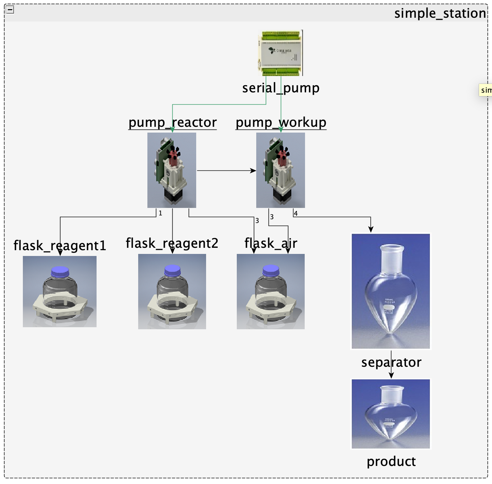
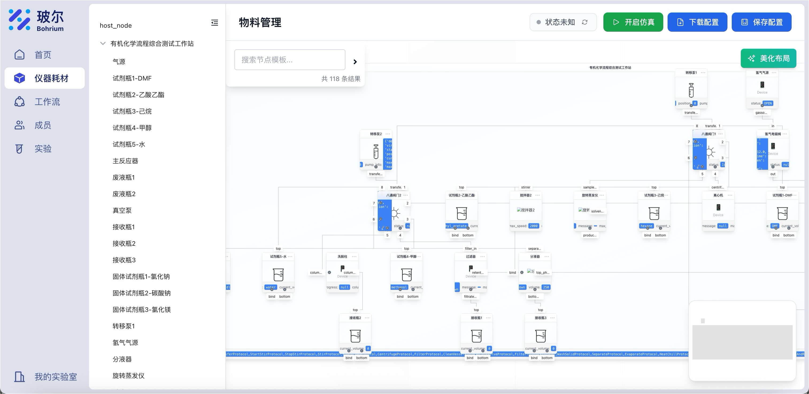
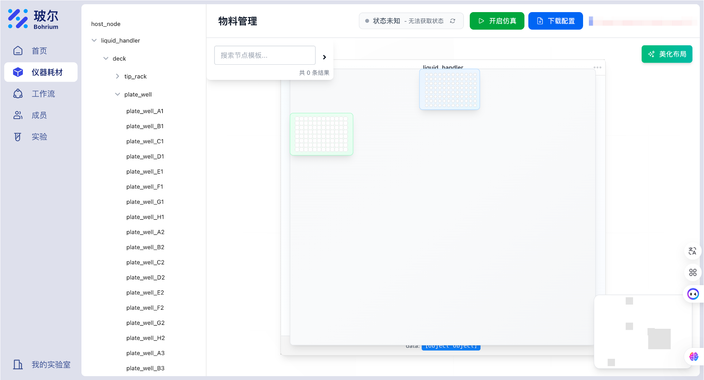
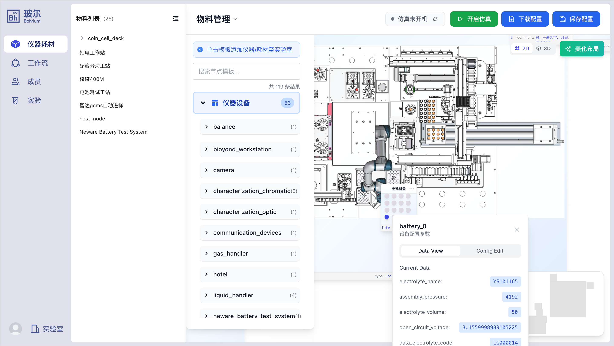

# 实例：工作站模板架构设计与对接指南

> **文档类型**：架构设计指南与实战案例  
> **适用场景**：大型工作站接入、子设备管理、物料系统集成  
> **前置知识**：{doc}`../add_device` | {doc}`../add_registry`

## 0. 问题简介

我们可以从以下几类例子，来理解对接大型工作站需要哪些设计。本文档之后的实战案例也将由这些组成。

### 0.1 自研常量有机工站：最重要的是子设备管理和通信转发





这类工站由开发者自研，组合所有子设备和实验耗材、希望让他们在工作站这一级协调配合；

1. 工作站包含大量已经注册的子设备，可能各自通信组态很不相同；部分设备可能会拥有同一个通信设备作为出口，如2个泵共用1个串口、所有设备共同接入PLC等。
2. 任务系统是统一实现的 protocols，protocols 中会将高层指令处理成各子设备配合的工作流 json并管理执行、同时更改物料信息
3. 物料系统较为简单直接，如常量有机化学仅为工作站内固定的瓶子，初始化时就已固定；随后在任务执行过程中，记录试剂量更改信息

### 0.2 移液工作站：物料系统和工作流模板管理



1. 绝大多数情况没有子设备，有时候选配恒温震荡等模块时，接口也由工作站提供
2. 所有任务系统均由工作站本身实现并下发指令，有统一的抽象函数可实现（pick_up_tips, aspirate, dispense, transfer 等）。有时需要将这些指令组合、转化为工作站的脚本语言，再统一下发。因此会形成大量固定的 protocols。
3. 物料系统为固定的板位系统：台面上有多个可摆放位置，摆放标准孔板。

### 0.3 厂家开发的定制大型工站



由厂家开发，具备完善的物料系统、任务系统甚至调度系统；由 PLC 或 OpenAPI TCP 协议统一通信

1. 在监控状态时，希望展现子设备的状态；但子设备仅为逻辑概念，通信由工作站上位机接口提供；部分情况下，子设备状态是被记录在文件中的，需要读取
2. 工作站有自己的工作流系统甚至调度系统；可以通过脚本/PLC连续读写来配置工作站可用的工作流；
3. 部分拥有完善的物料入库、出库、过程记录，需要与 Uni-Lab-OS 物料系统对接

## 1. 整体架构图

### 1.1 工作站核心架构

```{mermaid}
graph TB
    subgraph "工作站模板组成"
        WB[WorkstationBase<br/>工作流状态管理]
        RPN[ROS2WorkstationNode<br/>Protocol执行引擎]
        WB -.post_init关联.-> RPN
    end
    
    subgraph "物料管理系统"
        DECK[Deck<br/>PLR本地物料系统]
        RS[ResourceSynchronizer<br/>外部物料同步器]
        WB --> DECK
        WB --> RS
        RS --> DECK
    end
    
    subgraph "通信与子设备管理"
        HW[hardware_interface<br/>硬件通信接口]
        SUBDEV[子设备集合<br/>pumps/grippers/sensors]
        WB --> HW
        RPN --> SUBDEV
        HW -.代理模式.-> RPN
    end
    
    subgraph "工作流任务系统"
        PROTO[Protocol定义<br/>LiquidHandling/PlateHandling]
        WORKFLOW[Workflow执行器<br/>步骤管理与编排]
        RPN --> PROTO
        RPN --> WORKFLOW
        WORKFLOW --> SUBDEV
    end
```

### 1.2 外部系统对接关系

```{mermaid}
graph LR
    subgraph "Uni-Lab-OS工作站"
        WS[WorkstationBase + ROS2WorkstationNode]
        DECK2[物料系统<br/>Deck]
        HW2[通信接口<br/>hardware_interface]
        HTTP[HTTP服务<br/>WorkstationHTTPService]
    end
    
    subgraph "外部物料系统"
        BIOYOND[Bioyond物料管理]
        LIMS[LIMS系统]
        WAREHOUSE[第三方仓储]
    end
    
    subgraph "外部硬件系统"
        PLC[PLC设备]
        SERIAL[串口设备]
        ROBOT[机械臂/机器人]
    end
    
    subgraph "云端系统"
        CLOUD[UniLab云端<br/>资源管理]
        MONITOR[监控与调度]
    end
    
    BIOYOND <-->|RPC双向同步| DECK2
    LIMS -->|HTTP报送| HTTP
    WAREHOUSE <-->|API对接| DECK2
    
    PLC <-->|Modbus TCP| HW2
    SERIAL <-->|串口通信| HW2
    ROBOT <-->|SDK/API| HW2
    
    WS -->|ROS消息| CLOUD
    CLOUD -->|任务下发| WS
    MONITOR -->|状态查询| WS
```

### 1.3 具体实现示例

```{mermaid}
graph TB
    subgraph "工作站基类"
        BASE[WorkstationBase<br/>抽象基类]
    end
    
    subgraph "Bioyond集成工作站"
        BW[BioyondWorkstation]
        BW_DECK[Deck + Warehouses]
        BW_SYNC[BioyondResourceSynchronizer]
        BW_HW[BioyondV1RPC]
        BW_HTTP[HTTP报送服务]
        
        BW --> BW_DECK
        BW --> BW_SYNC
        BW --> BW_HW
        BW --> BW_HTTP
    end
    
    subgraph "纯协议节点"
        PN[ProtocolNode]
        PN_SUB[子设备集合]
        PN_PROTO[Protocol工作流]
        
        PN --> PN_SUB
        PN --> PN_PROTO
    end
    
    subgraph "PLC控制工作站"
        PW[PLCWorkstation]
        PW_DECK[Deck物料系统]
        PW_PLC[Modbus PLC客户端]
        PW_WF[工作流定义]
        
        PW --> PW_DECK
        PW --> PW_PLC
        PW --> PW_WF
    end
    
    BASE -.继承.-> BW
    BASE -.继承.-> PN
    BASE -.继承.-> PW
```

## 2. 类关系图

```{mermaid}
classDiagram
    class WorkstationBase {
        <<abstract>>
        +_ros_node: ROS2WorkstationNode
        +deck: Deck
        +plr_resources: Dict[str, PLRResource]
        +resource_synchronizer: ResourceSynchronizer
        +hardware_interface: Union[Any, str]
        +current_workflow_status: WorkflowStatus
        +supported_workflows: Dict[str, WorkflowInfo]
    
        +post_init(ros_node)*
        +set_hardware_interface(interface)
        +call_device_method(method, *args, **kwargs)
        +get_device_status()
        +is_device_available()
    
        +get_deck()
        +get_all_resources()
        +find_resource_by_name(name)
        +find_resources_by_type(type)
        +sync_with_external_system()
    
        +execute_workflow(name, params)
        +stop_workflow(emergency)
        +workflow_status
        +is_busy
    }
  
    class ROS2WorkstationNode {
        +device_id: str
        +children: Dict[str, Any]
        +sub_devices: Dict
        +protocol_names: List[str]
        +_action_clients: Dict
        +_action_servers: Dict
        +resource_tracker: DeviceNodeResourceTracker
    
        +initialize_device(device_id, config)
        +create_ros_action_server(action_name, mapping)
        +execute_single_action(device_id, action, kwargs)
        +update_resource(resources)
        +transfer_resource_to_another(resources, target, sites)
        +_setup_hardware_proxy(device, comm_device, read, write)
    }
  
    %% 物料管理相关类
    class Deck {
        +name: str
        +children: List
        +assign_child_resource()
    }
  
    class ResourceSynchronizer {
        <<abstract>>
        +workstation: WorkstationBase
        +sync_from_external()*
        +sync_to_external(plr_resource)*
        +handle_external_change(change_info)*
    }
  
    class BioyondResourceSynchronizer {
        +bioyond_api_client: BioyondV1RPC
        +sync_interval: int
        +last_sync_time: float
    
        +initialize()
        +sync_from_external()
        +sync_to_external(resource)
        +handle_external_change(change_info)
    }
  
    %% 硬件接口相关类
    class HardwareInterface {
        <<interface>>
    }
  
    class BioyondV1RPC {
        +base_url: str
        +api_key: str
        +stock_material()
        +add_material()
        +material_inbound()
    }
  
    %% 服务类
    class WorkstationHTTPService {
        +workstation: WorkstationBase
        +host: str
        +port: int
        +server: HTTPServer
        +running: bool
    
        +start()
        +stop()
        +_handle_step_finish_report()
        +_handle_sample_finish_report()
        +_handle_order_finish_report()
        +_handle_material_change_report()
        +_handle_error_handling_report()
    }
  
    %% 具体实现类
    class BioyondWorkstation {
        +bioyond_config: Dict
        +workflow_mappings: Dict
        +workflow_sequence: List
    
        +post_init(ros_node)
        +transfer_resource_to_another()
        +resource_tree_add(resources)
        +append_to_workflow_sequence(name)
        +get_all_workflows()
        +get_bioyond_status()
    }
  
    class ProtocolNode {
        +post_init(ros_node)
    }
  
    %% 核心关系
    WorkstationBase o-- ROS2WorkstationNode : post_init关联
    WorkstationBase o-- WorkstationHTTPService : 可选服务
  
    %% 物料管理侧
    WorkstationBase *-- Deck : deck
    WorkstationBase *-- ResourceSynchronizer : 可选组合
    ResourceSynchronizer <|-- BioyondResourceSynchronizer
  
    %% 硬件接口侧
    WorkstationBase o-- HardwareInterface : hardware_interface
    HardwareInterface <|.. BioyondV1RPC : 实现
    BioyondResourceSynchronizer --> BioyondV1RPC : 使用
  
    %% 继承关系
    BioyondWorkstation --|> WorkstationBase
    ProtocolNode --|> WorkstationBase
    ROS2WorkstationNode --|> BaseROS2DeviceNode : 继承
```

## 3. 工作站启动时序图

```{mermaid}
sequenceDiagram
    participant APP as Application
    participant WS as WorkstationBase
    participant DECK as PLR Deck
    participant SYNC as ResourceSynchronizer
    participant HW as HardwareInterface
    participant ROS as ROS2WorkstationNode
    participant HTTP as HTTPService
  
    APP->>WS: 创建工作站实例(__init__)
    WS->>DECK: 初始化PLR Deck
    DECK->>DECK: 创建Warehouse等子资源
    DECK-->>WS: Deck创建完成
  
    WS->>HW: 创建硬件接口(如BioyondV1RPC)
    HW->>HW: 建立连接(PLC/RPC/串口等)
    HW-->>WS: 硬件接口就绪
  
    WS->>SYNC: 创建ResourceSynchronizer(可选)
    SYNC->>HW: 使用hardware_interface
    SYNC->>SYNC: 初始化同步配置
    SYNC-->>WS: 同步器创建完成
  
    WS->>SYNC: sync_from_external()
    SYNC->>HW: 查询外部物料系统
    HW-->>SYNC: 返回物料数据
    SYNC->>DECK: 转换并添加到Deck
    SYNC-->>WS: 同步完成
  
    Note over WS: __init__完成,等待ROS节点
  
    APP->>ROS: 初始化ROS2WorkstationNode
    ROS->>ROS: 初始化子设备(children)
    ROS->>ROS: 创建Action客户端
    ROS->>ROS: 设置硬件接口代理
    ROS-->>APP: ROS节点就绪
  
    APP->>WS: post_init(ros_node)
    WS->>WS: self._ros_node = ros_node
    WS->>ROS: update_resource([deck])
    ROS->>ROS: 上传物料到云端
    ROS-->>WS: 上传完成
  
    WS->>HTTP: 创建WorkstationHTTPService(可选)
    HTTP->>HTTP: 启动HTTP服务器线程
    HTTP-->>WS: HTTP服务启动
  
    WS-->>APP: 工作站完全就绪
```

## 4. 工作流执行时序图（Protocol模式）

```{mermaid}
sequenceDiagram
    participant CLIENT as 客户端
    participant ROS as ROS2WorkstationNode
    participant WS as WorkstationBase
    participant HW as HardwareInterface
    participant DECK as PLR Deck
    participant CLOUD as 云端资源管理
    participant DEV as 子设备
  
    CLIENT->>ROS: 发送Protocol Action请求
    ROS->>ROS: execute_protocol回调
    ROS->>ROS: 从Goal提取参数
    ROS->>ROS: 调用protocol_steps_generator
    ROS->>ROS: 生成action步骤列表
  
    ROS->>WS: 更新workflow_status = RUNNING
  
    loop 执行每个步骤
        alt 调用子设备
            ROS->>ROS: execute_single_action(device_id, action, params)
            ROS->>DEV: 发送Action Goal(通过Action Client)
            DEV->>DEV: 执行设备动作
            DEV-->>ROS: 返回Result
        else 调用工作站自身
            ROS->>WS: call_device_method(method, *args)
            alt 直接模式
                WS->>HW: 调用hardware_interface方法
                HW->>HW: 执行硬件操作
                HW-->>WS: 返回结果
            else 代理模式
                WS->>ROS: 转发到子设备
                ROS->>DEV: 调用子设备方法
                DEV-->>ROS: 返回结果
                ROS-->>WS: 返回结果
            end
            WS-->>ROS: 返回结果
        end
    
        ROS->>DECK: 更新本地物料状态
        DECK->>DECK: 修改PLR资源属性
    end
  
    ROS->>CLOUD: 同步物料到云端(可选)
    CLOUD-->>ROS: 同步完成
  
    ROS->>WS: 更新workflow_status = COMPLETED
    ROS-->>CLIENT: 返回Protocol Result
```

## 5. HTTP报送处理时序图

```{mermaid}
sequenceDiagram
    participant EXT as 外部工作站/LIMS
    participant HTTP as HTTPService
    participant WS as WorkstationBase
    participant DECK as PLR Deck
    participant SYNC as ResourceSynchronizer
    participant CLOUD as 云端
  
    EXT->>HTTP: POST /report/step_finish
    HTTP->>HTTP: 解析请求数据
    HTTP->>HTTP: 验证LIMS协议字段
    HTTP->>WS: process_step_finish_report(request)
  
    WS->>WS: 增加接收计数(_reports_received_count++)
    WS->>WS: 记录步骤完成事件
    WS->>DECK: 更新相关物料状态(可选)
    DECK->>DECK: 修改PLR资源状态
  
    WS->>WS: 保存报送记录到内存
  
    WS-->>HTTP: 返回处理结果
    HTTP->>HTTP: 构造HTTP响应
    HTTP-->>EXT: 200 OK + acknowledgment_id
  
    Note over EXT,CLOUD: 类似处理sample_finish, order_finish等报送
  
    alt 物料变更报送
        EXT->>HTTP: POST /report/material_change
        HTTP->>WS: process_material_change_report(data)
        WS->>DECK: 查找或创建物料
        WS->>SYNC: sync_to_external(resource)
        SYNC->>SYNC: 同步到外部系统(如Bioyond)
        SYNC-->>WS: 同步完成
        WS->>CLOUD: update_resource(通过ROS节点)
        CLOUD-->>WS: 上传完成
        WS-->>HTTP: 返回结果
        HTTP-->>EXT: 200 OK
    end
```

## 6. 错误处理时序图

```{mermaid}
sequenceDiagram
    participant DEV as 子设备/外部系统
    participant ROS as ROS2WorkstationNode
    participant WS as WorkstationBase
    participant HW as HardwareInterface
    participant HTTP as HTTPService
    participant LOG as 日志系统
  
    alt 设备错误(ROS Action失败)
        DEV->>ROS: Action返回失败结果
        ROS->>ROS: 记录错误信息
        ROS->>WS: 更新workflow_status = ERROR
        ROS->>LOG: 记录错误日志
    else 外部系统错误报送
        DEV->>HTTP: POST /report/error_handling
        HTTP->>WS: handle_external_error(error_data)
        WS->>WS: 记录错误历史
        WS->>LOG: 记录错误日志
    end
  
    alt 关键错误需要停止
        WS->>ROS: stop_workflow(emergency=True)
        ROS->>ROS: 取消所有进行中的Action
        ROS->>HW: 调用emergency_stop()(如果支持)
        HW->>HW: 执行紧急停止
        WS->>WS: 更新workflow_status = ERROR
    else 可恢复错误
        WS->>WS: 标记步骤失败
        WS->>ROS: 触发重试逻辑(可选)
        ROS->>DEV: 重新发送Action
    end
  
    WS-->>HTTP: 返回错误处理结果
    HTTP-->>DEV: 200 OK + 处理状态
```

## 7. 典型工作站实现示例

### 7.1 Bioyond集成工作站实现

```python
class BioyondWorkstation(WorkstationBase):
    def __init__(self, bioyond_config: Dict, deck: Deck, *args, **kwargs):
        # 初始化deck
        super().__init__(deck=deck, *args, **kwargs)
      
        # 设置硬件接口为Bioyond RPC客户端
        self.hardware_interface = BioyondV1RPC(bioyond_config)
      
        # 创建资源同步器
        self.resource_synchronizer = BioyondResourceSynchronizer(self)
      
        # 从Bioyond同步物料到本地deck
        self.resource_synchronizer.sync_from_external()
      
        # 配置工作流
        self.workflow_mappings = bioyond_config.get("workflow_mappings", {})
  
    def post_init(self, ros_node: ROS2WorkstationNode):
        """ROS节点就绪后的初始化"""
        self._ros_node = ros_node
      
        # 上传deck(包括所有物料)到云端
        ROS2DeviceNode.run_async_func(
            self._ros_node.update_resource, 
            True, 
            resources=[self.deck]
        )
  
    def resource_tree_add(self, resources: List[ResourcePLR]):
        """添加物料并同步到Bioyond"""
        for resource in resources:
            self.deck.assign_child_resource(resource, location)
            self.resource_synchronizer.sync_to_external(resource)
```

### 7.2 纯协议节点实现

```python
class ProtocolNode(WorkstationBase):
    """纯协议节点,不需要物料管理和外部通信"""
  
    def __init__(self, deck: Optional[Deck] = None, *args, **kwargs):
        super().__init__(deck=deck, *args, **kwargs)
        # 不设置hardware_interface和resource_synchronizer
        # 所有功能通过子设备协同完成
  
    def post_init(self, ros_node: ROS2WorkstationNode):
        self._ros_node = ros_node
        # 不需要上传物料或其他初始化
```

### 7.3 PLC直接控制工作站

```python
class PLCWorkstation(WorkstationBase):
    def __init__(self, plc_config: Dict, deck: Deck, *args, **kwargs):
        super().__init__(deck=deck, *args, **kwargs)
      
        # 设置硬件接口为Modbus客户端
        from pymodbus.client import ModbusTcpClient
        self.hardware_interface = ModbusTcpClient(
            host=plc_config["host"],
            port=plc_config["port"]
        )
        self.hardware_interface.connect()
      
        # 定义支持的工作流
        self.supported_workflows = {
            "battery_assembly": WorkflowInfo(
                name="电池组装",
                description="自动化电池组装流程",
                estimated_duration=300.0,
                required_materials=["battery_cell", "connector"],
                output_product="battery_pack",
                parameters_schema={"quantity": int, "model": str}
            )
        }
  
    def execute_workflow(self, workflow_name: str, parameters: Dict):
        """通过PLC执行工作流"""
        workflow_id = self._get_workflow_id(workflow_name)
      
        # 写入PLC寄存器启动工作流
        self.hardware_interface.write_register(100, workflow_id)
        self.hardware_interface.write_register(101, parameters["quantity"])
      
        self.current_workflow_status = WorkflowStatus.RUNNING
        return True
```

## 8. 核心接口说明

### 8.1 WorkstationBase核心属性

| 属性                        | 类型                    | 说明                          |
| --------------------------- | ----------------------- | ----------------------------- |
| `_ros_node`               | ROS2WorkstationNode     | ROS节点引用，由post_init设置  |
| `deck`                    | Deck                    | PyLabRobot Deck，本地物料系统 |
| `plr_resources`           | Dict[str, PLRResource]  | 物料资源映射                  |
| `resource_synchronizer`   | ResourceSynchronizer    | 外部物料同步器(可选)          |
| `hardware_interface`      | Union[Any, str]         | 硬件接口或代理字符串          |
| `current_workflow_status` | WorkflowStatus          | 当前工作流状态                |
| `supported_workflows`     | Dict[str, WorkflowInfo] | 支持的工作流定义              |

### 8.2 必须实现的方法

- `post_init(ros_node)`: ROS节点就绪后的初始化，必须实现

### 8.3 硬件接口相关方法

- `set_hardware_interface(interface)`: 设置硬件接口
- `call_device_method(method, *args, **kwargs)`: 统一设备方法调用
  - 支持直接模式: 直接调用hardware_interface的方法
  - 支持代理模式: hardware_interface="proxy:device_id"通过ROS转发
- `get_device_status()`: 获取设备状态
- `is_device_available()`: 检查设备可用性

### 8.4 物料管理方法

- `get_deck()`: 获取PLR Deck
- `get_all_resources()`: 获取所有物料
- `find_resource_by_name(name)`: 按名称查找物料
- `find_resources_by_type(type)`: 按类型查找物料
- `sync_with_external_system()`: 触发外部同步

### 8.5 工作流控制方法

- `execute_workflow(name, params)`: 执行工作流
- `stop_workflow(emergency)`: 停止工作流
- `workflow_status`: 获取工作流状态(属性)
- `is_busy`: 检查是否忙碌(属性)
- `workflow_runtime`: 获取运行时间(属性)

### 8.6 可选的HTTP报送处理方法

- `process_step_finish_report()`: 步骤完成处理
- `process_sample_finish_report()`: 样本完成处理
- `process_order_finish_report()`: 订单完成处理
- `process_material_change_report()`: 物料变更处理
- `handle_external_error()`: 错误处理

### 8.7 ROS2WorkstationNode核心方法

- `initialize_device(device_id, config)`: 初始化子设备
- `create_ros_action_server(action_name, mapping)`: 创建Action服务器
- `execute_single_action(device_id, action, kwargs)`: 执行单个动作
- `update_resource(resources)`: 同步物料到云端
- `transfer_resource_to_another(...)`: 跨设备物料转移

## 9. 配置参数说明

### 9.1 工作站初始化配置

```python
# 示例1: Bioyond集成工作站
bioyond_config = {
    "base_url": "http://192.168.1.100:8080",
    "api_key": "your_api_key",
    "sync_interval": 600,  # 同步间隔(秒)
    "workflow_mappings": {
        "样品制备": "workflow_uuid_1",
        "质检流程": "workflow_uuid_2"
    },
    "material_type_mappings": {
        "plate": "板",
        "tube": "试管"
    },
    "warehouse_mapping": {
        "冷藏区": {
            "uuid": "warehouse_uuid_1",
            "locations": {...}
        }
    }
}

# 创建Deck
from pylabrobot.resources import Deck
deck = Deck(name="main_deck", size_x=1000, size_y=800, size_z=200)

workstation = BioyondWorkstation(
    bioyond_config=bioyond_config,
    deck=deck
)
```

### 9.2 子设备配置(children)

```python
# 在devices.json中配置
{
    "bioyond_workstation": {
        "type": "protocol",  # 表示这是工作站节点
        "protocol_type": ["LiquidHandling", "PlateHandling"],
        "children": {
            "pump_1": {
                "type": "device",
                "driver": "TricontInnovaDriver",
                "communication": "serial_1",
                "config": {...}
            },
            "gripper_1": {
                "type": "device", 
                "driver": "RobotiqGripperDriver",
                "communication": "io_modbus_1",
                "config": {...}
            },
            "serial_1": {
                "type": "communication",
                "protocol": "serial",
                "port": "/dev/ttyUSB0",
                "baudrate": 9600
            },
            "io_modbus_1": {
                "type": "communication",
                "protocol": "modbus_tcp",
                "host": "192.168.1.101",
                "port": 502
            }
        }
    }
}
```

### 9.3 HTTP服务配置

```python
from unilabos.devices.workstation.workstation_http_service import WorkstationHTTPService

# 创建HTTP服务(可选)
http_service = WorkstationHTTPService(
    workstation_instance=workstation,
    host="0.0.0.0",  # 监听所有网卡
    port=8081
)
http_service.start()
```

## 10. 架构设计特点总结

这个简化后的架构设计具有以下特点：

### 10.1 清晰的职责分离

- **WorkstationBase**: 负责物料管理(deck)、硬件接口(hardware_interface)、工作流状态管理
- **ROS2WorkstationNode**: 负责子设备管理、Protocol执行、云端物料同步
- **ResourceSynchronizer**: 可选的外部物料系统同步(如Bioyond)
- **WorkstationHTTPService**: 可选的HTTP报送接收服务

### 10.2 灵活的硬件接口模式

1. **直接模式**: hardware_interface是具体对象(如BioyondV1RPC、ModbusClient)
2. **代理模式**: hardware_interface="proxy:device_id"，通过ROS节点转发到子设备
3. **混合模式**: 工作站有自己的接口，同时管理多个子设备

### 10.3 统一的物料系统

- 基于PyLabRobot Deck的标准化物料表示
- 通过ResourceSynchronizer实现与外部系统(如Bioyond、LIMS)的双向同步
- 通过ROS2WorkstationNode实现与云端的物料状态同步

### 10.4 Protocol驱动的工作流

- ROS2WorkstationNode负责Protocol的执行和步骤管理
- 支持子设备协同(通过Action Client调用)
- 支持工作站直接控制(通过hardware_interface)

### 10.5 可选的HTTP报送服务

- 基于LIMS协议规范的统一报送接口
- 支持步骤完成、样本完成、任务完成、物料变更等多种报送类型
- 与工作站解耦，可独立启停

### 10.6 简化的初始化流程

```
1. __init__: 创建deck、设置hardware_interface、创建resource_synchronizer
2. 从外部系统同步物料(如果有)
3. ROS节点初始化子设备
4. post_init: 关联ROS节点、上传物料到云端
5. (可选)启动HTTP服务
```

这种设计既保持了灵活性，又避免了过度抽象，更适合实际的工作站对接场景。
