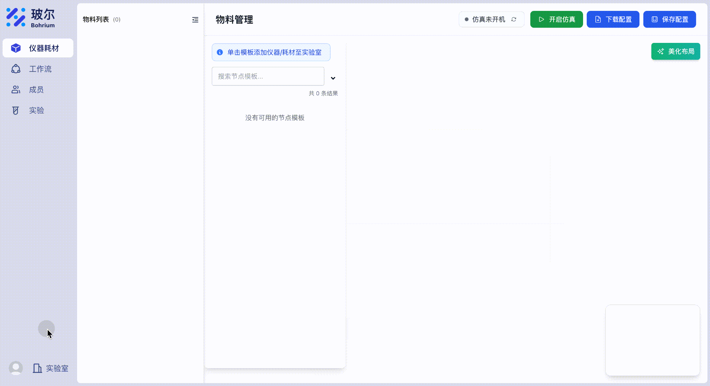
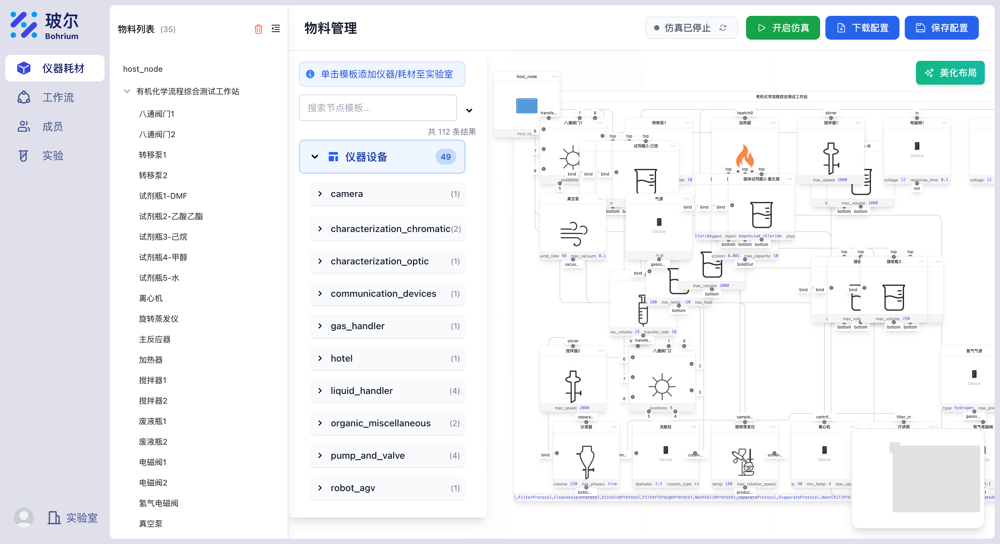
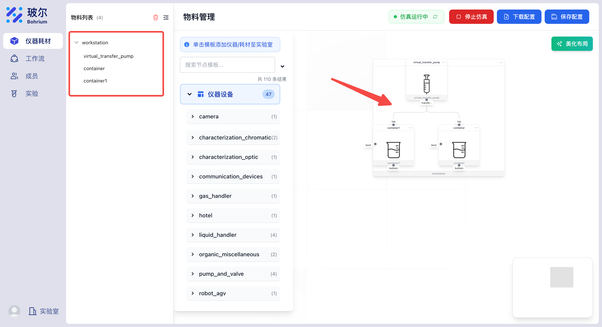
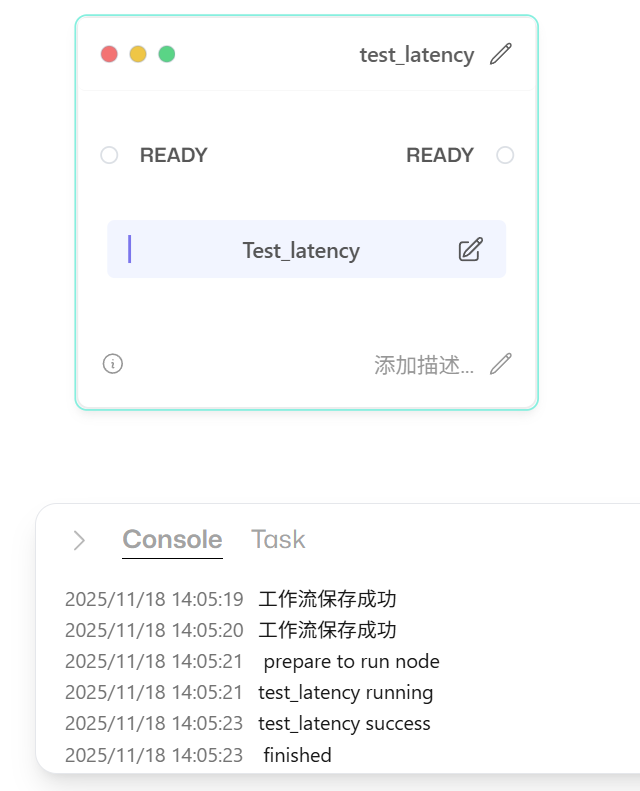
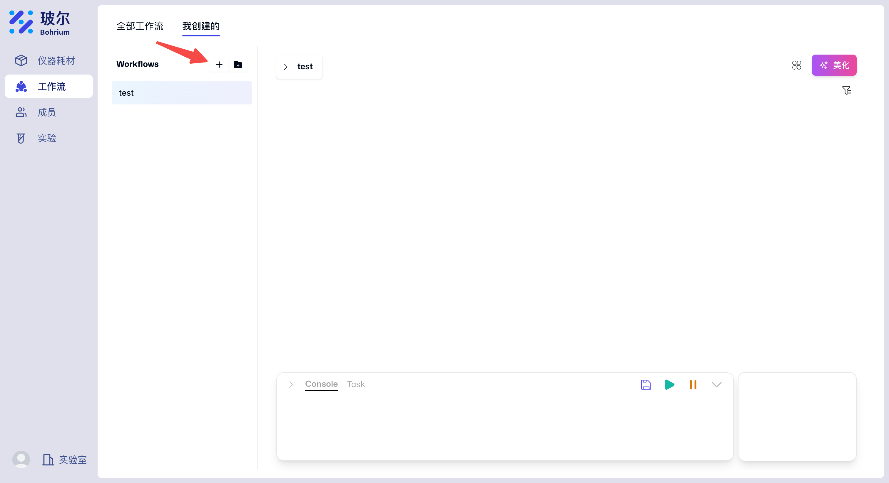
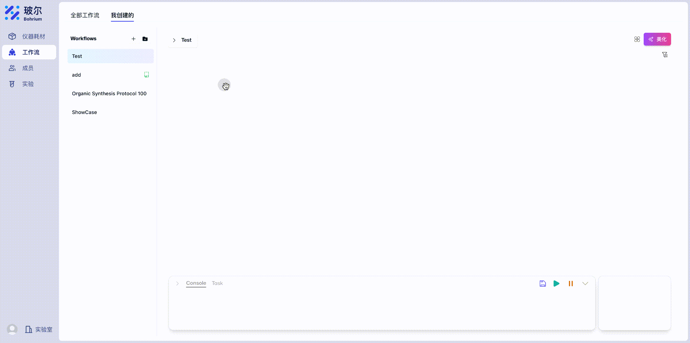
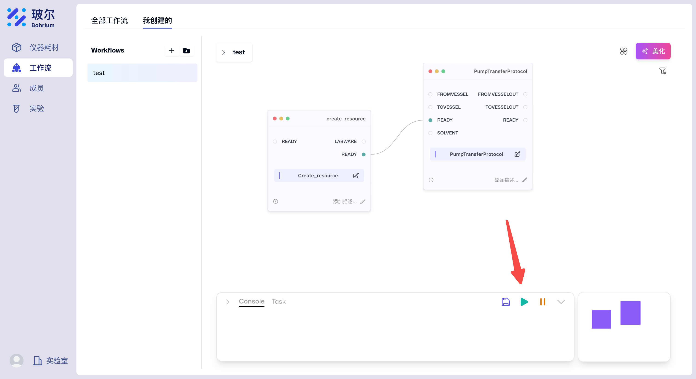

# Uni-Lab-OS 最佳实践指南

## 关于本指南

本指南将引导您从零开始完成 Uni-Lab-OS 实验室系统的完整搭建，从环境安装到高级设备开发。无论您是初次接触 Uni-Lab-OS 的用户，还是希望深入定制开发的开发者，都能在本指南中找到清晰的步骤和实用建议。

### 适用对象

- **实验室管理员**：负责实验室系统部署和维护
- **实验操作人员**：日常使用系统进行实验操作
- **设备开发者**：为实验室添加自定义设备和功能
- **系统集成商**：集成多个实验室系统

### 完整流程概览

```
环境准备 → 创建实验室账号 → 系统启动 → 上传注册表
    ↓
在线创建设备图 → 测试系统运行 → 运行工作流
    ↓
多节点部署（可选）→ 自定义设备开发 → 复杂工作站搭建
```

---

## 第一部分：快速上手

### 1. 环境准备（主机 Host）

#### 1.1 安装 Uni-Lab-OS

详细的安装步骤请参考 [安装指南](installation.md)。

**关键步骤：**

```bash
# 1. 安装 Mamba（如果尚未安装）
# 下载 Miniforge: https://github.com/conda-forge/miniforge/releases

# 2. 创建 Conda 环境
mamba create -n unilab python=3.11.11

# 3. 激活环境
mamba activate unilab

# 4. 安装 Uni-Lab-OS
mamba install uni-lab::unilabos -c robostack-staging -c conda-forge
```

#### 1.2 验证安装

```bash
# 检查 unilabos 是否安装成功
python -c "import unilabos; print(unilabos.__version__)"

# 验证 ROS 消息包
python -c "from unilabos_msgs.msg import Resource; print('ROS msgs OK')"
```

如果两条命令都正常输出，说明安装成功。

---

### 2. 创建您的第一个实验室

#### 2.1 注册实验室账号

1. 访问 [https://uni-lab.bohrium.com](https://uni-lab.bohrium.com)
2. 注册账号并登录
3. 创建新实验室

#### 2.2 获取 Access Key 和 Secret Key

1. 在实验室管理界面，找到"密钥管理"
2. 创建新的 AK/SK 密钥对
3. **妥善保管这些密钥**（类似于密码，不要泄露）



**重要提示：**

- AK (Access Key)：实验室的唯一标识
- SK (Secret Key)：实验室的访问密码
- 这两个密钥在后续启动命令中都需要使用

#### 2.3 首次启动配置

首次启动时，系统会自动引导您创建配置文件：

```bash
# 首次启动
conda activate unilab
unilab --ak your_ak --sk your_sk
```

系统会询问是否创建配置文件，输入 `Y` 确认。配置文件会自动生成在 `./unilabos_data/local_config.py`。

更多配置选项请参考 [配置指南](../advanced_usage/configuration.md)。

---

### 3. 启动系统

详细的启动参数说明请参考 [启动指南](launch.md)。

#### 3.1 基本启动命令

```bash
conda activate unilab
unilab --ak your_ak --sk your_sk -g path/to/graph.json
```

**关键参数说明：**

- `--ak`：您的 Access Key（必需）
- `--sk`：您的 Secret Key（必需）
- `-g`：设备组态图文件路径（必需）

#### 3.2 首次启动注意事项

**第一次启动时，如果没有组态图文件：**

由于首次启动需要 `-g` 参数指定组态图，您可以：

**方案 1：使用预先创建好的示例组态图（推荐）**

Uni-Lab-OS 在安装时已经预置了大量真实的设备图文件示例，无需下载或创建，直接使用 `-g` 参数指定即可：

```bash
# 使用简单的工作台示例（推荐新手）
unilab --ak your_ak --sk your_sk -g test/experiments/workshop.json

# 使用 PRCXI 液体处理工作站示例
unilab --ak your_ak --sk your_sk -g test/experiments/prcxi_9300.json

# 使用格林纳德反应工作站示例（有机合成）
unilab --ak your_ak --sk your_sk -g test/experiments/Grignard_flow_batchreact_single_pumpvalve.json

# 使用 Bioyond 配液站示例
unilab --ak your_ak --sk your_sk -g test/experiments/dispensing_station_bioyond.json

# 使用 HPLC 分析系统示例
unilab --ak your_ak --sk your_sk -g test/experiments/HPLC.json

# 使用空设备配置（最小化配置）
unilab --ak your_ak --sk your_sk -g test/experiments/empty_devices.json
```

**更多可用示例**：系统预置了 40+ 个组态图文件，涵盖液体处理、有机合成、分析检测等多个领域。完整列表请查看 `unilabos/test/experiments/` 目录。

**方案 2：创建一个空的组态图**

如果您想从零开始配置，可以创建一个简单的主机节点配置：

```bash
# 创建 example_empty.json
cat > example_empty.json << 'EOF'
{
  "nodes": [],
  "links": []
}
EOF

# 使用该配置启动
unilab --ak your_ak --sk your_sk -g example_empty.json
```

> **提示**：详细的组态图文件编写指南，请参考 [设备图文件说明](graph_files.md)。

**启动成功标志：**

- 终端显示 `[Host Node] Host node initialized.`
- 自动打开浏览器，显示 Web 管理界面
- 地址：`http://localhost:8002`

#### 3.3 常用启动选项

```bash
# 禁用自动打开浏览器
unilab --ak your_ak --sk your_sk -g graph.json --disable_browser

# 使用不同端口
unilab --ak your_ak --sk your_sk -g graph.json --port 8080

# 测试环境
unilab --addr test --ak your_ak --sk your_sk -g graph.json

# 跳过环境检查（加快启动）
unilab --ak your_ak --sk your_sk -g graph.json --skip_env_check
```

---

### 4. 上传注册表（一次性操作）

#### 4.1 什么是注册表上传？

注册表包含您的设备和物料的完整定义。上传到云端后，在线界面才能识别和使用这些设备。

#### 4.2 何时需要上传？

**必须上传的情况：**

- 首次启动实验室
- 添加了新的设备类型
- 修改了设备的注册表定义

#### 4.3 如何上传注册表

```bash
unilab --ak your_ak --sk your_sk -g graph.json --upload_registry
```

**性能影响说明：**

- 上传注册表会增加启动时间（通常 5-15 秒）
- 上传时间取决于：
  - 设备和物料的数量
  - 网络速度
- 建议：开发调试时首次上传，后续本地测试可省略

**验证上传成功：**

在 Web 界面的"仪器设备"或"物料耗材"模块中，应该能看到您的设备和物料列表。

---

### 5. 在线创建您的第一个设备图

#### 5.1 使用预设组态图（推荐新手）

Uni-Lab-OS 在安装时已经包含了大量真实的设备图文件，位于 `unilabos/test/experiments/` 目录，涵盖：

- 液体处理：PRCXI、Biomek 等自动化移液工作站
- 有机合成：格林纳德反应、流动化学等工作站
- 分析检测：HPLC、光谱仪等分析仪器
- 生物实验：Bioyond 配液站、反应站等
- 协议测试：各种实验协议的测试工作站
- 虚拟设备：用于开发调试的 mock 设备

**常用示例组态图：**

| 组态图文件                                       | 说明                 | 适合场景             |
| ------------------------------------------------ | -------------------- | -------------------- |
| `workshop.json`                                  | 综合工作台           | 新手入门推荐         |
| `empty_devices.json`                             | 空设备配置           | 最小化配置，快速启动 |
| `prcxi_9300.json`                                | PRCXI 液体处理工作站 | 液体处理自动化       |
| `Grignard_flow_batchreact_single_pumpvalve.json` | 格林纳德反应工作站   | 有机合成流动化学     |
| `dispensing_station_bioyond.json`                | Bioyond 配液站       | 生物样品配液         |
| `reaction_station_bioyond.json`                  | Bioyond 反应站       | 生物化学反应         |
| `HPLC.json`                                      | HPLC 分析系统        | 色谱分析             |
| `plr_test.json`                                  | PyLabRobot 测试      | PyLabRobot 集成测试  |
| `mock_devices/mock_all.json`                     | 完整虚拟设备集       | 开发调试，离线测试   |

**使用方法：**

```bash
# 使用简单工作台（推荐新手第一次启动）
unilab --ak your_ak --sk your_sk -g test/experiments/workshop.json

# 使用 PRCXI 液体处理工作站
unilab --ak your_ak --sk your_sk -g test/experiments/prcxi_9300.json

# 使用格林纳德反应工作站（有机合成）
unilab --ak your_ak --sk your_sk -g test/experiments/Grignard_flow_batchreact_single_pumpvalve.json

# 使用虚拟设备（无需真实硬件，用于学习和测试）
unilab --ak your_ak --sk your_sk -g test/experiments/mock_devices/mock_all.json
```

**注意**：所有组态图文件都是真实项目中使用的配置，可以直接学习和参考。完整文件列表请查看 `unilabos/test/experiments/` 目录。

> 关于设备图文件的结构、字段定义、格式兼容性等完整指南，请参考 [设备图文件说明](graph_files.md)。

#### 5.2 访问 Web 界面

启动系统后，访问[https://uni-lab.bohrium.com](https://uni-lab.bohrium.com)

#### 5.3 添加设备和物料

进入"仪器耗材"模块：

**示例场景：** 创建一个简单的液体转移实验

1. **添加工作站（必需）：**

   - 在"仪器设备"中找到 `work_station`
   - 添加 `workstation` x1

2. **添加虚拟转移泵：**

   - 在"仪器设备"中找到 `virtual_device`
   - 添加 `virtual_transfer_pump` x1

3. **添加容器：**
   - 在"物料耗材"中找到 `container`
   - 添加 `container` x2



#### 5.4 建立设备连接关系

将设备和物料拖拽到画布上，建立父子关系：

1. 将两个 `container` 拖拽到 `workstation` 中
2. 将 `virtual_transfer_pump` 拖拽到 `workstation` 中
3. 在画布上连接它们（模拟真实的物理连接）



**连接规则：**

- 所有设备和物料都必须有父节点（除了顶层工作站）
- 连接关系反映真实的物理布局
- 连接后才能在工作流中使用

#### 5.5 保存组态图

1. 点击"保存"按钮
2. 系统会生成 JSON 格式的组态图
3. 可以下载保存为本地文件，下次使用 `-g` 参数启动

---

### 6. 测试实验室运行状态

在运行实际工作流之前，建议先测试系统是否正常运行。

#### 6.1 使用 host_node 的 test_latency

`test_latency` 是 host_node 提供的测试方法，用于：

- 测试网络延迟
- 校准时间误差
- 验证系统响应

**通过 Web 界面测试：**

1. 在 Web 界面找到"工作流"模块
2. 新建空白工作流
3. 右键画布空白处，找到 `laboratory` -> `host_node` 在动作列表中找到 `test_latency`
4. 设置"关联设备名称"为 `host_node`


5. 点击保存，然后运行工作流



6. 在控制台查看执行结果，点击查看返回值


**测试结果解读：**

系统会进行 5 次 ping-pong 测试，返回 JSON 格式的结果，包含以下关键指标：

- **avg_rtt_ms**：平均往返延迟（毫秒），正常应在几十到几百毫秒
- **avg_time_diff_ms**：主机与云端的平均时间差（毫秒）
- **max_time_error_ms**：最大时间误差（毫秒）
- **raw_delay_ms**：原始延迟测量值（毫秒）
- **task_delay_ms**：任务处理延迟（毫秒）
- **test_count**：测试次数
- **status**：测试状态（success 表示成功）

**实际返回结果示例：**

```json
{
  "error": "",
  "return_value": {
    "avg_rtt_ms": 49.64,
    "avg_time_diff_ms": 3872.43,
    "max_time_error_ms": 3885.34,
    "raw_delay_ms": 3900.24,
    "status": "success",
    "task_delay_ms": 27.8,
    "test_count": 5
  },
  "suc": true
}
```

**结果评估：**

- `avg_rtt_ms < 100ms`：网络连接良好
- `avg_rtt_ms 100-500ms`：网络可用，略有延迟
- `avg_rtt_ms > 500ms`：网络延迟较高，建议检查网络配置
- `status: "success"`：测试通过

---

### 7. 运行您的第一个工作流

现在系统已经正常运行，让我们通过一个完整的案例来创建并执行第一个工作流。

#### 7.1 工作流场景

我们将实现一个简单的液体转移实验：

1. 在容器 1 中加入水
2. 通过传输泵将容器 1 中的水转移到容器 2

#### 7.2 添加所需的设备和物料

在创建工作流之前，我们需要先在"仪器耗材"模块中添加必要的设备和物料。

**所需设备和物料清单：**

- 仪器设备 `work_station` 中的 `workstation` 数量 x1
- 仪器设备 `virtual_device` 中的 `virtual_transfer_pump` 数量 x1
- 物料耗材 `container` 中的 `container` 数量 x2

**操作步骤：**

1. 访问 Web 界面，进入"仪器耗材"模块
2. 在"仪器设备"区域找到并添加上述设备
3. 在"物料耗材"区域找到并添加容器


#### 7.3 建立设备和物料的关联关系

当我们添加设备时，仪器耗材模块的物料列表会实时更新。我们需要将设备和物料拖拽到 workstation 中并在画布上将它们连接起来，就像真实的设备操作一样。

**操作步骤：**

1. 将两个 `container` 拖拽到 `workstation` 中
2. 将 `virtual_transfer_pump` 拖拽到 `workstation` 中
3. 在画布上连接它们（建立父子关系）


**连接规则：**

- 所有设备和物料都必须有父节点（除了顶层工作站）
- 连接关系反映真实的物理布局
- 连接后才能在工作流中使用

#### 7.4 创建工作流

1. 进入"工作流"模块
2. 点击"我创建的"
3. 点击"新建工作流"



#### 7.5 新增工作流节点

我们可以进入指定工作流，在空白处右键，添加以下节点：

- 选择 **Laboratory → host_node** 中的 `creat_resource`
- 选择 **Laboratory → workstation** 中的 `PumpTransferProtocol`



#### 7.6 配置节点参数

根据案例，工作流包含两个步骤：

1. 使用 `creat_resource` 在容器中创建水
2. 通过泵传输协议将水传输到另一个容器

**配置 creat_resource 节点：**

点击 `creat_resource` 卡片上的编辑按钮，配置参数：

```
class_name: container
device_id: workstation
liquid_input_slot: 0 或 -1 均可
liquid_type: water
liquid_volume: 50（根据需求填写，默认单位 ml，这里举例 50）
parent: workstation
res_id: container
关联设备名称(原 unilabos_device_id): host_node
```

配置完成后点击底部保存按钮。

**配置 PumpTransferProtocol 节点：**

点击 `PumpTransferProtocol` 卡片上的编辑按钮，配置参数：

```
event: transfer_liquid
from_vessel: water
to_vessel: container1
volume: 50（根据需求填写，默认单位 ml，这里举例 50）
关联设备名称(原 unilabos_device_id): workstation
```

配置完成后点击底部保存按钮。

#### 7.7 运行工作流

1. 连接两个节点卡片（creat_resource → PumpTransferProtocol）
2. 点击底部保存按钮
3. 点击运行按钮执行工作流



#### 7.8 运行监控

- 运行状态和消息实时显示在底部控制台
- 如有报错，可点击查看详细信息
- 查看日志文件：`unilabos_data/logs/unilab.log`

#### 7.9 结果验证

工作流完成后，返回"仪器耗材"模块：

1. 点击 `container1` 卡片查看详情
2. 确认其中包含参数指定的水和容量（50ml 的水）

至此，您已经成功运行了第一个工作流。

---

## 第二部分：进阶部署

### 8. 多节点部署（Slave 模式）

详细的组网部署和主从模式配置请参考 [组网部署与主从模式配置](../developer_guide/networking_overview.md)。

#### 8.1 主从模式概述

**适用场景：**

- 设备物理位置分散在不同房间
- 需要独立的故障隔离域
- 逐步扩展实验室规模
- 分布式实验操作

**架构：**

```
主节点（Host）
    ├── 本地设备A
    ├── 本地设备B
    └── ROS2 通信 ←→ 从节点（Slave）
                        ├── 远程设备C
                        └── 远程设备D
```

#### 8.2 准备工作

**主节点准备：**

1. 确保主节点已正常启动
2. 记录主节点的 IP 地址
3. 确保网络互通（同一局域网或 VPN）

**网络要求：**

- 主从节点在同一局域网
- 可以互相 ping 通
- 确保 ROS2 通信端口畅通

**验证网络连通性：**

在配置完成后，使用 ROS2 自带的 demo 节点来验证跨节点通信是否正常：

**在主节点机器上**（激活 unilab 环境后）：

```bash
# 终端1：启动 talker
ros2 run demo_nodes_cpp talker

# 终端2：启动 listener
ros2 run demo_nodes_cpp listener
```

**在从节点机器上**（激活 unilab 环境后）：

```bash
# 终端1：启动 talker
ros2 run demo_nodes_cpp talker

# 终端2：启动 listener
ros2 run demo_nodes_cpp listener
```

**注意**：必须在两台机器上**互相启动** talker 和 listener，否则可能出现只能收不能发的单向通信问题。

**预期结果：**

- 每台机器的 listener 应该能同时接收到本地和远程 talker 发送的消息
- 如果只能看到本地消息，说明网络配置有问题
- 如果两台机器都能互相收发消息，则组网配置正确

**如果验证失败，尝试关闭防火墙：**

为了确保 ROS2 DDS 通信正常，建议直接关闭防火墙，而不是配置特定端口。ROS2 使用动态端口范围，配置特定端口可能导致通信问题。

**Linux：**

```bash
# 关闭防火墙
sudo ufw disable

# 或者临时停止防火墙
sudo systemctl stop ufw
```

**Windows：**

```powershell
# 在 Windows 安全中心关闭防火墙
# 控制面板 -> 系统和安全 -> Windows Defender 防火墙 -> 启用或关闭 Windows Defender 防火墙
```

#### 8.3 启动主节点

```bash
# 在主机（Host）上启动
conda activate unilab
unilab --ak your_ak --sk your_sk -g host.json --upload_registry
```

**主节点职责：**

- 与云端通信
- 管理全局资源
- 协调所有节点

#### 8.4 启动从节点

在另一台机器上：

```bash
# 在从机（Slave）上启动
conda activate unilab
unilab --ak your_ak --sk your_sk -g slave.json --is_slave
```

**从节点职责：**

- 管理本地设备
- 向主节点注册
- 执行分配的任务
- 不直接与云端通信

**重要：** 从节点使用相同的 AK/SK，因为它们属于同一个实验室。

#### 8.5 判断连接成功

**方法 1：检查 ROS2 节点列表**

在任一节点上运行：

```bash
ros2 node list
```

应该看到来自两个节点的设备：

```
/devices/host_node
/devices/workstation
/devices/liquid_handler_1  # 从节点的设备
```

**方法 2：查看主节点设备列表**

在主节点的 Web 界面：

1. 进入"仪器耗材"模块
2. 查看设备列表
3. 从节点的设备应显示为"在线"状态
4. 设备卡片上会显示来源机器名称

**方法 3：查看日志**

主节点日志会显示：

```
[Host Node] Node info update request received
[Host Node] Slave node registered: liquid_handler_1 from Machine_B
```

从节点日志会显示：

```
Slave node info updated.
Resource tree synchronized with host.
```

#### 8.6 注册机制说明

从节点启动时会自动向主节点注册：

**注册流程（代码逻辑）：**

1. **从节点启动**（`base_device_node.py` 的 `register_device` 方法）：

   ```python
   # 检测到非 Host 模式
   if not BasicConfig.is_host_mode:
       # 创建服务客户端
       sclient = self.create_client(SerialCommand, "/node_info_update")
       # 发送注册信息
       self.send_slave_node_info(sclient)
   ```

2. **发送注册信息**（`main_slave_run.py`）：

   ```python
   request.command = json.dumps({
       "machine_name": BasicConfig.machine_name,
       "type": "slave",
       "devices_config": devices_config.dump(),
       "registry_config": registry_config,
   })
   ```

3. **主节点接收**（`host_node.py` 的 `_node_info_update_callback` 方法）：
   ```python
   def _node_info_update_callback(self, request, response):
       info = json.loads(request.command)
       machine_name = info["machine_name"]
       edge_device_id = info["edge_device_id"]
       # 记录设备来源机器
       self.device_machine_names[edge_device_id] = machine_name
   ```

**关键点：**

- 注册是自动的，无需手动配置
- 主节点会记录每个设备来自哪台机器
- 从节点需要等待主节点的服务可用

#### 8.7 常见问题

**问题 1：从节点启动卡住**

```
Waiting for host service...
```

**解决方案：**

- 检查主节点是否已启动
- 验证网络连通性
- 使用 `--slave_no_host` 参数跳过等待（仅用于测试）

**问题 2：节点看不到彼此**

**解决方案：**

- 确保在同一网络
- 关闭防火墙
- 设置相同的 `ROS_DOMAIN_ID`（可选）

**问题 3：注册失败**

**解决方案：**

- 检查 AK/SK 是否正确
- 查看主节点日志
- 重启从节点

---

## 第三部分：自定义开发

### 9. 创建您的第一个自定义设备

详细的设备驱动编写指南请参考 [添加设备驱动](../developer_guide/add_device.md)。

#### 9.1 为什么需要自定义设备？

Uni-Lab-OS 内置了常见设备，但您的实验室可能有特殊设备需要集成：

- 自研仪器
- 定制化改造的商业设备
- 特殊的实验流程
- 第三方设备集成

#### 9.2 创建 Python 包

为了方便开发和管理，建议为您的实验室创建独立的 Python 包。

**包结构：**

```
my_lab_devices/
├── setup.py
├── README.md
├── my_lab_devices/
│   ├── __init__.py
│   ├── devices/
│   │   ├── __init__.py
│   │   ├── my_pump.py
│   │   └── my_sensor.py
│   └── registry/
│       ├── devices/
│       │   ├── my_pump.yaml
│       │   └── my_sensor.yaml
│       └── resources/
│           └── my_container.yaml
```

**创建步骤：**

```bash
# 1. 创建包目录
mkdir -p my_lab_devices/my_lab_devices/devices
mkdir -p my_lab_devices/my_lab_devices/registry/devices
mkdir -p my_lab_devices/my_lab_devices/registry/resources

# 2. 创建 __init__.py
touch my_lab_devices/my_lab_devices/__init__.py
touch my_lab_devices/my_lab_devices/devices/__init__.py
```

#### 9.3 创建 setup.py

```python
# my_lab_devices/setup.py

from setuptools import setup, find_packages

setup(
    name="my_lab_devices",
    version="0.1.0",
    description="My Laboratory Custom Devices",
    author="Your Name",
    author_email="your.email@example.com",
    packages=find_packages(),
    install_requires=[
        "unilabos",  # 依赖 Uni-Lab-OS
        # 添加其他依赖
        # "pyserial",
        # "requests",
    ],
    python_requires=">=3.11",
    # 包含注册表文件
    package_data={
        "my_lab_devices": [
            "registry/devices/*.yaml",
            "registry/resources/*.yaml",
        ],
    },
)
```

#### 9.4 开发安装

使用 `-e` 参数进行可编辑安装，这样代码修改后立即生效：

```bash
cd my_lab_devices
pip install -e . -i https://mirrors.tuna.tsinghua.edu.cn/pypi/web/simple
```

**优势：**

- 代码修改实时生效，无需重新安装
- 方便调试和测试
- 支持版本控制（git）

#### 9.5 编写设备驱动

创建设备驱动文件：

```python
# my_lab_devices/my_lab_devices/devices/my_pump.py

from typing import Dict, Any
from unilabos.registry.placeholder_type import ResourceSlot

class MyPump:
    """自定义注射泵驱动

    支持功能：
    - 注射液体
    - 抽取液体
    - 速率控制
    """

    def __init__(self, config: Dict[str, Any]):
        """初始化设备

        Args:
            config: 配置字典，包含端口、波特率等
        """
        self.port = config.get('port', 'COM1')
        self.baudrate = config.get('baudrate', 9600)
        self._status = "idle"
        self._current_volume = 0.0

        # 初始化串口连接
        # self.serial = serial.Serial(self.port, self.baudrate)
        print(f"MyPump initialized on {self.port}")

    @property
    def status(self) -> str:
        """设备状态"""
        return self._status

    @property
    def current_volume(self) -> float:
        """当前注射器内液体体积（ml）"""
        return self._current_volume

    def infuse(
        self,
        target: ResourceSlot,
        volume: float,
        rate: float = 1.0
    ) -> Dict[str, Any]:
        """注射液体到目标容器

        Args:
            target: 目标容器（前端显示资源选择器）
            volume: 注射体积（ml）
            rate: 注射速率（ml/min）

        Returns:
            执行结果
        """
        self._status = "infusing"

        print(f"Infusing {volume}ml to {target.name} at {rate}ml/min")

        # 发送命令到硬件
        # self.serial.write(f"INF {volume} {rate}\r\n".encode())

        # 模拟执行
        import time
        time.sleep(volume / rate * 60)  # 模拟注射时间

        self._current_volume -= volume
        self._status = "idle"

        return {
            "success": True,
            "volume_infused": volume,
            "target": target.id,
            "message": f"Successfully infused {volume}ml"
        }

    def withdraw(
        self,
        source: ResourceSlot,
        volume: float,
        rate: float = 1.0
    ) -> Dict[str, Any]:
        """从源容器抽取液体

        Args:
            source: 源容器（前端显示资源选择器）
            volume: 抽取体积（ml）
            rate: 抽取速率（ml/min）

        Returns:
            执行结果
        """
        self._status = "withdrawing"

        print(f"Withdrawing {volume}ml from {source.name} at {rate}ml/min")

        # 发送命令到硬件
        # self.serial.write(f"WDR {volume} {rate}\r\n".encode())

        # 模拟执行
        import time
        time.sleep(volume / rate * 60)

        self._current_volume += volume
        self._status = "idle"

        return {
            "success": True,
            "volume_withdrawn": volume,
            "source": source.id,
            "message": f"Successfully withdrawn {volume}ml"
        }

    def set_rate(self, rate: float) -> Dict[str, Any]:
        """设置流速

        Args:
            rate: 流速（ml/min）
        """
        print(f"Setting rate to {rate}ml/min")
        # self.serial.write(f"RAT {rate}\r\n".encode())

        return {
            "success": True,
            "rate": rate,
            "message": f"Rate set to {rate}ml/min"
        }
```

**关键点：**

- **类型注解**：使用 `ResourceSlot` 等特殊类型
- **@property**：状态属性会自动广播
- **返回 Dict**：所有动作方法返回字典类型
- **文档字符串**：详细说明参数和功能

#### 9.6 测试设备驱动

创建简单的测试脚本：

```python
# test_my_pump.py

from my_lab_devices.devices.my_pump import MyPump

# 创建设备实例
config = {
    "port": "COM1",
    "baudrate": 9600
}
pump = MyPump(config)

# 测试状态属性
print(f"Status: {pump.status}")
print(f"Current volume: {pump.current_volume}ml")

# 模拟注射（不使用 ResourceSlot）
class MockResource:
    id = "test_container"
    name = "测试容器"

result = pump.infuse(MockResource(), volume=5.0, rate=2.0)
print(f"Result: {result}")
```

运行测试：

```bash
python test_my_pump.py
```

---

### 10. 生成和完善设备注册表

注册表（Registry）是 Uni-Lab-OS 的核心配置文件，定义了设备的动作、状态、参数等信息。系统提供了自动生成功能，帮助您快速完成基础配置。

> 完整的注册表编写、字段说明、高级配置等内容，请参考 [添加设备注册表](../developer_guide/add_registry.md)。

#### 10.1 注册表目录结构

Uni-Lab-OS 使用三类注册表：

```
registry/
├── devices/          # 设备注册表（仪器设备，如泵、加热器、机械臂等）
├── device_comms/     # 通信驱动注册表（如 Modbus、OPC UA）
└── resources/        # 物料注册表（耗材、容器，如孔板、试管、试剂等）
```

#### 10.2 生成注册表（两种方式）

**方式 1：使用 Web 界面注册表编辑器（推荐）**

1. 访问 Web 界面，进入"注册表编辑器"
2. 上传您的 Python 设备驱动文件
3. 点击"分析文件"，系统自动生成注册表
4. 填写描述、图标等元数据
5. 下载生成的 YAML 文件到您的注册表目录

**方式 2：使用 `--complete_registry` 参数（命令行）**

```bash
unilab --ak your_ak --sk your_sk -g graph.json \
       --registry_path ./my_lab_devices/registry \
       --complete_registry
```

系统会自动：

- 扫描 Python 设备类
- 分析方法签名和类型注解
- 识别 `ResourceSlot`、`DeviceSlot` 等特殊类型
- 生成完整的 YAML 注册表文件

#### 10.3 生成的注册表示例

自动生成的注册表大致如下（已简化）：

```yaml
my_pump:
  class:
    module: my_lab_devices.devices.my_pump:MyPump
    type: python

    status_types: # 自动提取的状态
      status: str
      current_volume: float

    action_value_mappings: # 自动生成的动作
      infuse:
        type: UniLabJsonCommand
        goal:
          target: target
          volume: volume
        placeholder_keys:
          target: unilabos_resources # 自动识别 ResourceSlot
        result:
          success: success

  description: '自定义注射泵驱动'
  version: '1.0.0'
```

系统会自动识别特殊类型并生成前端选择器：

| Python 类型          | 前端效果       |
| -------------------- | -------------- |
| `ResourceSlot`       | 资源单选下拉框 |
| `List[ResourceSlot]` | 资源多选下拉框 |
| `DeviceSlot`         | 设备单选下拉框 |
| `List[DeviceSlot]`   | 设备多选下拉框 |

#### 10.4 使用自定义注册表

启动时指定注册表路径：

```bash
unilab --ak your_ak --sk your_sk -g graph.json \
       --registry_path ./my_lab_devices/registry \
       --upload_registry
```

**支持多个注册表路径**（按顺序查找）：

```bash
unilab --ak your_ak --sk your_sk -g graph.json \
       --registry_path ./my_lab_devices/registry \
       --registry_path ./another_lab/registry
```

#### 10.5 验证注册表

**验证方法：**

1. **查看启动日志**：确认设备被正确加载
2. **访问 Web 界面**："仪器设备"模块中应能看到您的自定义设备
3. **测试动作调用**：在工作流中测试设备动作是否正常

#### 10.6 手动完善注册表（可选）

自动生成的注册表已经可用，但您可以手动添加以下内容来提升用户体验：

- **description**：设备详细描述
- **icon**：设备图标（支持 Base64 或 URL）
- **category**：设备分类标签（用于前端分组显示）
- **handles**：设备连接点定义（用于可视化连接）

**示例：**

```yaml
my_pump:
  description: '高精度注射泵，支持 0.001-100 ml/min 流速范围'
  icon: 'pump_icon.webp'
  category:
    - pump
    - liquid_handling
  # ... 其他配置
```

> 关于注册表的高级配置、字段详解、最佳实践等，请参考 [添加设备注册表](../developer_guide/add_registry.md)。

---

### 11. 创建复杂工作站

详细的工作站架构请参考 [工作站架构](../developer_guide/examples/workstation_architecture.md)。

#### 11.1 什么是复杂工作站？

复杂工作站是多个设备和物料的集合，协同完成特定实验流程。

**示例场景：**

- **液体处理工作站**：移液器 + 孔板 + 试剂槽 + 枪头架
- **有机合成工作站**：反应釜 + 注射泵 + 加热搅拌器 + 冷凝器
- **分析工作站**：色谱仪 + 进样器 + 流动相泵

#### 11.2 设计工作站

**设计原则：**

1. **模块化**：每个设备独立，可单独控制
2. **层次化**：使用父子关系组织设备
3. **标准化**：使用统一的接口和命名

**工作站结构：**

```
Workstation（工作站根节点）
├── Deck（甲板/平台）
│   ├── PlateCarrier_1（板位）
│   │   └── Plate_96（96孔板）
│   ├── PlateCarrier_2
│   │   └── Plate_384（384孔板）
│   └── TipRack（枪头架）
├── Pipette_8（8通道移液器）
└── WashStation（清洗站）
```

#### 11.3 组合多个设备

在组态图中：

1. 创建工作站根节点（通常是 `workstation`）
2. 添加子设备
3. 建立连接关系
4. 配置每个设备的参数

**JSON 组态示例：**

```json
{
  "nodes": [
    {
      "id": "liquid_handler_ws",
      "name": "液体处理工作站",
      "type": "device",
      "class": "workstation",
      "config": {}
    },
    {
      "id": "pipette_8ch",
      "name": "8通道移液器",
      "type": "device",
      "class": "pipette_8_channel",
      "config": {
        "volume_range": [0.5, 300]
      }
    },
    {
      "id": "plate_carrier_1",
      "name": "板位1",
      "type": "resource",
      "class": "plate_carrier",
      "config": {}
    }
  ],
  "links": [
    {
      "source": "liquid_handler_ws",
      "target": "pipette_8ch",
      "type": "contains"
    },
    {
      "source": "liquid_handler_ws",
      "target": "plate_carrier_1",
      "type": "contains"
    }
  ]
}
```

#### 11.4 设计工作流程

**复杂工作站的工作流特点：**

- 多步骤协同
- 设备间依赖
- 状态管理
- 错误恢复

**示例：96 孔板液体分配流程**

```
1. 准备阶段
   ├── 检查枪头架
   ├── 检查孔板位置
   └── 检查试剂体积

2. 执行阶段
   ├── 装载枪头
   ├── 从试剂槽吸取
   ├── 移动到目标孔板
   ├── 分配液体
   └── 退出枪头

3. 清理阶段
   ├── 清洗移液器
   └── 复位到初始位置
```

**在 Uni-Lab 中实现：**

1. 创建工作流
2. 添加各步骤节点
3. 配置每个节点的设备和参数
4. 连接节点形成流程
5. 添加错误处理分支

#### 11.5 通信共享机制

在复杂工作站中，多个设备可能需要共享同一个通信端口（如串口、PLC），但大多数通信端口只能被一个实例占用。通信共享机制解决了这个问题，允许灵活控制连接到同一通信端口的多个设备。

##### 11.5.1 应用场景

**典型场景：**

- **多泵阀共享 PLC 串口**：所有泵阀通过同一个 PLC 控制，泵阀数量可灵活增减
- **多传感器共享 Modbus**：多个传感器通过同一个 Modbus 设备读取数据
- **多设备共享 TCP/IP**：多台设备共享一个 TCP/IP 通信接口

**解决思路：**

创建一个**通信设备作为代理**，所有需要使用该端口的设备通过代理进行通信，而不是直接访问端口。

##### 11.5.2 配置步骤

**步骤 1：定义 workstation 并指定 protocol_type**

在组态图中，workstation 的 `config` 需要添加 `protocol_type`（协议类型列表，可为空）：

```json
{
  "id": "simple_station",
  "name": "简单工作站",
  "type": "device",
  "class": "workstation",
  "parent": null,
  "config": {
    "protocol_type": ["PumpTransferProtocol", "CleanProtocol"]
  },
  "children": ["serial_pump", "pump_1", "pump_2", "pump_3"]
}
```

> **说明**：`children` 列表中，**通信设备必须排在最前面**（如 `"serial_pump"`），确保它先于其他设备初始化。

**步骤 2：创建通信设备（作为代理）**

在 workstation 的子设备中，**首先定义通信设备**（必须在其他设备之前初始化，因此放到启动 json 靠前的位置）：

```json
{
  "id": "serial_pump",
  "type": "device",
  "class": "serial",
  "parent": "simple_station",
  "config": {
    "port": "COM7",
    "baudrate": 9600
  }
}
```

**步骤 3：配置使用该通信的设备**

其他设备的 `config` 中指向通信设备（字段名根据设备注册表定义，如 `port` 或 `io_device_port`，他们在驱动中）：

```json
{
  "id": "pump_1",
  "type": "device",
  "class": "syringe_pump_with_valve.runze.SY03B-T06",
  "parent": "simple_station",
  "config": {
    "port": "serial_pump", // 直接使用通信设备的设备名，最终能够通过__init__实现self.hardware_interface变量设定为serial_pump的字符串
    "address": "1",
    "max_volume": 25.0
  }
}
```

> 配置字段的值直接是**通信设备的设备名**（如 `"serial_pump"`），不是完整路径。系统会自动进行变量替换。

**步骤 4：建立通信连接关系**

在组态图的 `links` 中，建立 `communication` 类型的连接：

```json
{
  "links": [
    {
      "source": "pump_1",
      "target": "serial_pump",
      "type": "communication",
      "port": {
        "serial_pump": "1" // 通信端口号或地址
      }
    },
    {
      "source": "pump_2",
      "target": "serial_pump",
      "type": "communication",
      "port": {
        "serial_pump": "2"
      }
    }
  ]
}
```

> **说明**：`port` 字段中的值是通信设备上的端口号或地址，具体含义取决于通信协议。

##### 11.5.3 注册表配置

**通信设备的注册表**（例如`device_comms/modbus_ioboard.yaml`）：

```yaml
io_snrd:
  class:
    module: unilabos.device_comms.SRND_16_IO:SRND_16_IO
    type: python

    # hardware_interface.name 对象是实际的通信实例（如 ModbusClient()）
    # 通过 Python 的 __init__ 方法初始化
    hardware_interface:
      name: modbus_client
      read: read_io_coil
      write: write_io_coil

  description: 'IO Board with 16 IOs via Modbus'
```

**使用通信的设备注册表**（`devices/pump_and_valve.yaml`）：

```yaml
syringe_pump_with_valve.runze.SY03B-T06:
  class:
    module: unilabos.devices.pump_and_valve.runze_backbone:RunzeSyringePump
    type: python

    # hardware_interface.name 初始化时是通信设备的设备名（字符串）
    # 通过启动 JSON 的 config 传入（如 "port": "serial_pump"）
    # 系统会自动将字符串替换为实际的通信实例
    hardware_interface:
      name: hardware_interface
      read: send_command
      write: send_command

    action_value_mappings:
      # 设备的动作定义

solenoid_valve:
  class:
    module: unilabos.devices.pump_and_valve.solenoid_valve:SolenoidValve
    type: python

    # 使用 io_device_port 字段接收通信设备名
    hardware_interface:
      name: io_device_port # 例如当前电磁阀修改了name，从默认的hardware_interface改成了io_device_port，那么启动json中就应该对__init__中的io_device_port进行赋值
      read: read_io_coil
      write: write_io_coil
```

**关键机制：**

| 设备类型           | hardware_interface.name | 初始化方式                                    | 运行时对象                          |
| ------------------ | ----------------------- | --------------------------------------------- | ----------------------------------- |
| **通信设备**       | `modbus_client` 等      | Python `__init__` 中创建实例                  | `ModbusClient()`、`serial.Serial()` |
| **使用通信的设备** | `hardware_interface` 等 | config 中传入设备名字符串（如 `"io_device"`） | **系统自动替换**为实际通信实例      |

**自动替换流程：**

1. 设备初始化时，`self.hardware_interface = "io_device"`（字符串）
2. workstation 检测到 `config` 中有通信设备名
3. 系统自动将 `self.hardware_interface` 替换为 `io_device` 的实际通信实例
4. 设备可以直接调用 `self.hardware_interface.read_io_coil()` 等方法

**完整示例：Modbus IO 板控制多个电磁阀**

```json
{
  "nodes": [
    {
      "id": "WorkStationTestMinimumSystem",
      "name": "工作站节点",
      "children": [
        "io_device",
        "Product1_Solenoid_Valve",
        "Water_Solenoid_Valve"
      ],
      "parent": null,
      "type": "device",
      "class": "workstation",
      "config": {
        "protocol_type": []
      }
    },
    {
      "id": "io_device",
      "class": "io_snrd", // 通信设备类型
      "name": "io_device",
      "config": {
        "address": "192.168.1.7:23", // Modbus TCP 地址
        "slave_id": "1"
      },
      "parent": "WorkStationTestMinimumSystem",
      "type": "device"
    },
    {
      "id": "Product1_Solenoid_Valve",
      "class": "solenoid_valve",
      "name": "Product1_Solenoid_Valve",
      "config": {
        "io_device_port": "io_device" // 通信设备的设备名（字符串）
      },
      "parent": "WorkStationTestMinimumSystem",
      "type": "device"
    },
    {
      "id": "Water_Solenoid_Valve",
      "class": "solenoid_valve",
      "name": "Water_Solenoid_Valve",
      "config": {
        "io_device_port": "io_device" // 同样使用这个通信设备
      },
      "parent": "WorkStationTestMinimumSystem",
      "type": "device"
    }
  ],
  "links": []
}
```

**工作原理：**

1. `io_device` 初始化时创建 `ModbusClient("192.168.1.7:23")`
2. 两个电磁阀的 `self.io_device_port` 初始化为字符串 `"io_device"`
3. workstation 自动将 `self.io_device_port` 替换为实际的 `ModbusClient` 实例
4. 电磁阀可以通过 `self.io_device_port.read_io_coil(15)` 或 `write_io_coil(14)` 操作

##### 11.5.4 验证通信共享

**启动成功标志：**

系统启动时，在日志中查看以下提示信息：

```
通信代理：为子设备 pump_1 配置通信代理 serial_pump
通信代理：为子设备 pump_2 配置通信代理 serial_pump
通信代理：为子设备 pump_3 配置通信代理 serial_pump
```

看到此提示说明通信共享配置成功。

**测试步骤：**

1. 启动系统，查看日志确认通信代理配置成功
2. 在 Web 界面中，分别控制 `pump_1`、`pump_2`、`pump_3`
3. 确认所有泵都能正常响应（通过同一个串口）
4. 查看通信设备的状态，确认消息正常传递

---

### 12. 撰写物料定义

详细的物料编写指南请参考：

- [物料构建指南](../developer_guide/examples/materials_construction_guide.md)
- [物料教程](../developer_guide/examples/materials_tutorial.md)

#### 12.1 物料（Resource）概述

物料是实验中使用的消耗品和容器：

- **容器**：孔板、试管、烧杯、反应瓶
- **耗材**：枪头、移液管、过滤器
- **试剂**：溶剂、试剂、样品

#### 12.2 创建自定义物料类型

**场景：** 创建实验室特殊规格的孔板

```python
# my_lab_devices/my_lab_devices/resources/custom_plate.py

from pylabrobot.resources import Plate, Well
from typing import List

class CustomPlate48(Plate):
    """自定义 48 孔板

    规格：
    - 6行 x 8列
    - 孔体积：2ml
    - 孔间距：18mm
    """

    def __init__(self, name: str):
        super().__init__(
            name=name,
            size_x=127.76,  # mm
            size_y=85.48,   # mm
            size_z=14.35,   # mm
            model="custom_48_wellplate_2000ul"
        )

        # 定义孔位
        self._create_wells()

    def _create_wells(self):
        """创建 48 个孔位"""
        rows = "ABCDEF"
        cols = range(1, 9)

        well_size_x = 16.0  # mm
        well_size_y = 16.0
        well_depth = 12.0
        spacing_x = 18.0
        spacing_y = 18.0

        for row_idx, row in enumerate(rows):
            for col in cols:
                well_name = f"{row}{col}"
                x = (col - 1) * spacing_x + 10  # 10mm 边距
                y = row_idx * spacing_y + 10

                well = Well(
                    name=well_name,
                    size_x=well_size_x,
                    size_y=well_size_y,
                    size_z=well_depth,
                    max_volume=2000,  # μL
                )
                well.location = (x, y, 0)
                self.children.append(well)
```

#### 12.3 物料注册表

创建物料注册表：

```yaml
# my_lab_devices/my_lab_devices/registry/resources/custom_plate.yaml

custom_48_wellplate_2000ul:
  class:
    module: my_lab_devices.resources.custom_plate:CustomPlate48
    type: python

  description: '自定义 48 孔板，2ml 孔体积'
  version: '1.0.0'
  category:
    - plate
    - container

  # 物料属性
  properties:
    rows: 6
    columns: 8
    well_count: 48
    well_volume: 2000 # μL
    well_shape: 'round'
    material: 'polystyrene'

  # 尺寸信息
  dimensions:
    size_x: 127.76
    size_y: 85.48
    size_z: 14.35
    unit: 'mm'

  # 兼容性
  compatible_with:
    - 'plate_carrier'
    - 'thermal_cycler'

  icon: ''
```

#### 12.4 物料属性定义

**常见属性：**

```yaml
properties:
  # 容量相关
  max_volume: 2000 # μL
  min_volume: 10 # μL
  dead_volume: 5 # μL（无法吸取的残留体积）

  # 几何形状
  shape: 'round' # round, square, v_bottom
  diameter: 16.0 # mm
  depth: 12.0 # mm

  # 材质
  material: 'polystyrene' # 聚苯乙烯
  transparency: true # 透明
  sterile: false # 无菌

  # 温度范围
  min_temperature: -80 # °C
  max_temperature: 121 # °C

  # 化学兼容性
  chemical_compatibility:
    - 'water'
    - 'ethanol'
    - 'dmso'

  # 条形码
  barcode_support: true
  barcode_type: '1D'
```

#### 12.5 在系统中使用自定义物料

1. **注册物料**：

```bash
unilab --ak your_ak --sk your_sk -g graph.json \
       --registry_path ./my_lab_devices/my_lab_devices/registry \
       --upload_registry
```

2. **在组态图中添加**：

在 Web 界面的"物料耗材"模块中，找到 `custom_48_wellplate_2000ul`，添加到实验室。

3. **在工作流中使用**：

工作流节点的参数中，涉及容器选择的地方会显示您的自定义物料。

---

## 第四部分：最佳实践总结

### 13. 开发流程建议

```
需求分析 → 环境搭建 → 原型验证 → 迭代开发 → 测试部署 → 生产运行
```

**详细步骤：**

1. **需求分析**：

   - 明确实验流程
   - 列出所需设备和物料
   - 设计工作流程图

2. **环境搭建**：

   - 安装 Uni-Lab-OS
   - 创建实验室账号
   - 准备开发工具（IDE、Git）

3. **原型验证**：

   - 使用虚拟设备测试流程
   - 验证工作流逻辑
   - 调整参数

4. **迭代开发**：

   - 实现自定义设备驱动（同时撰写单点函数测试）
   - 编写注册表
   - 单元测试
   - 集成测试

5. **测试部署**：

   - 连接真实硬件
   - 空跑测试
   - 小规模试验

6. **生产运行**：
   - 全量部署
   - 监控运行状态
   - 持续优化

---

### 14. 进一步学习资源

#### 14.1 官方文档

- **安装指南**：[installation.md](installation.md)
- **启动指南**：[launch.md](launch.md)
- **配置指南**：[../advanced_usage/configuration.md](../advanced_usage/configuration.md)

#### 14.2 开发者文档

- **组网部署与主从模式**：[../developer_guide/networking_overview.md](../developer_guide/networking_overview.md)
- **添加设备驱动**：[../developer_guide/add_device.md](../developer_guide/add_device.md)
- **老设备驱动开发**：[../developer_guide/add_old_device.md](../developer_guide/add_old_device.md)
- **添加动作指令**：[../developer_guide/add_action.md](../developer_guide/add_action.md)
- **YAML 注册表编写**：[../developer_guide/add_yaml.md](../developer_guide/add_yaml.md)
- **添加设备注册表**：[../developer_guide/add_registry.md](../developer_guide/add_registry.md)
- **工作站架构**：[../developer_guide/examples/workstation_architecture.md](../developer_guide/examples/workstation_architecture.md)
- **物料构建指南**：[../developer_guide/examples/materials_construction_guide.md](../developer_guide/examples/materials_construction_guide.md)

#### 14.3 进阶主题

- **工作目录详解**：[../advanced_usage/working_directory.md](../advanced_usage/working_directory.md)
<!-- 以下文档待补充：
- **远程资源管理**：[../deployment/03_remote_resources.md](../deployment/03_remote_resources.md)
- **云端集成**：[../deployment/04_cloud_integration.md](../deployment/04_cloud_integration.md)
- **生产环境部署**：[../deployment/05_production_deployment.md](../deployment/05_production_deployment.md)
  -->

#### 14.4 外部资源

- **ROS 2 文档**：[https://docs.ros.org/en/humble/](https://docs.ros.org/en/humble/)
- **PyLabRobot**：[https://github.com/PyLabRobot/pylabrobot](https://github.com/PyLabRobot/pylabrobot)
- **Python 类型注解**：[https://docs.python.org/3/library/typing.html](https://docs.python.org/3/library/typing.html)
- **YAML 语法**：[https://yaml.org/](https://yaml.org/)

#### 14.5 社区支持

- **GitHub Issues**：[https://github.com/dptech-corp/Uni-Lab-OS/issues](https://github.com/dptech-corp/Uni-Lab-OS/issues)
- **官方网站**：[https://uni-lab.bohrium.com](https://uni-lab.bohrium.com)

---

## 结语

通过本指南，您应该已经掌握了：

- 安装和配置 Uni-Lab-OS 环境
- 创建和管理实验室
- 启动系统并运行工作流
- 部署多节点分布式系统
- 开发自定义设备驱动
- 创建和注册物料定义
- 构建复杂工作站

**下一步建议：**

1. 从简单的工作流开始实践，逐步尝试更复杂的场景
2. 在 GitHub 上提问和分享经验
3. 关注文档更新和新功能发布
4. 为 Uni-Lab-OS 社区贡献您的设备驱动和最佳实践

---

_本指南最后更新：2025-11_
_Uni-Lab-OS 版本：最新稳定版_
