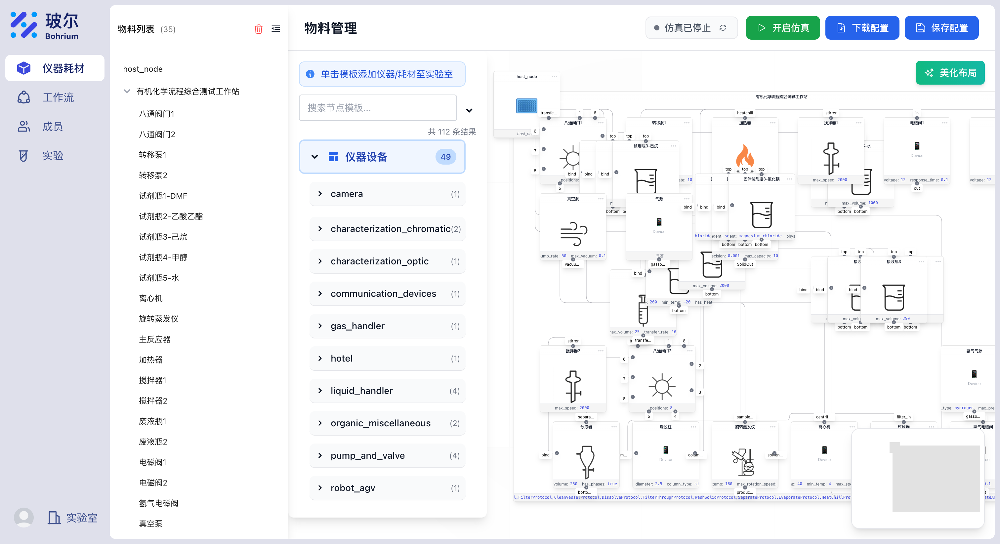
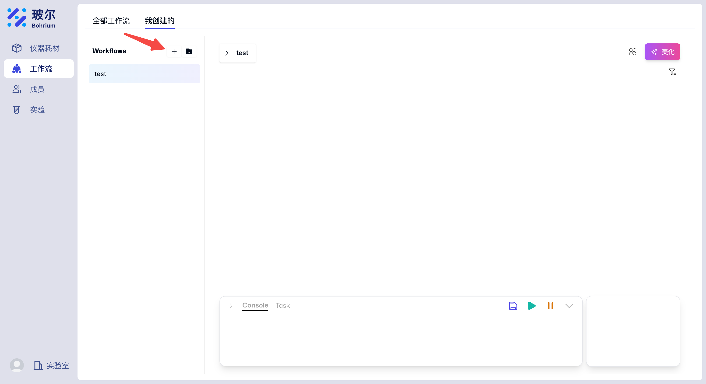
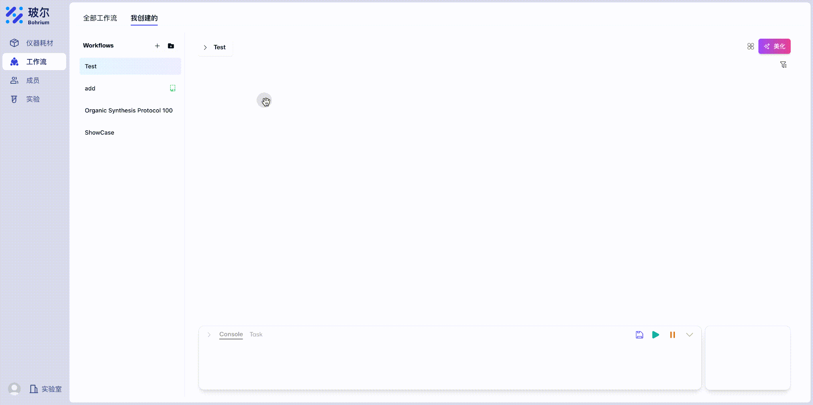
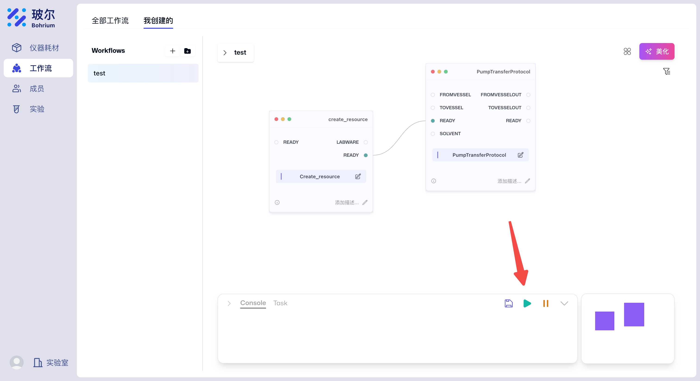

# Uni-Lab 启动指南

安装完毕后，可以通过 `unilab` 命令行启动：

```bash
Start Uni-Lab Edge server.

options:
  -h, --help            show this help message and exit
  -g GRAPH, --graph GRAPH
                        Physical setup graph file path.
  -c CONTROLLERS, --controllers CONTROLLERS
                        Controllers config file path.
  --registry_path REGISTRY_PATH
                        Path to the registry directory
  --working_dir WORKING_DIR
                        Path to the working directory
  --backend {ros,simple,automancer}
                        Choose the backend to run with: 'ros', 'simple', or 'automancer'.
  --app_bridges APP_BRIDGES [APP_BRIDGES ...]
                        Bridges to connect to. Now support 'websocket' and 'fastapi'.
  --is_slave            Run the backend as slave node (without host privileges).
  --slave_no_host       Skip waiting for host service in slave mode
  --upload_registry     Upload registry information when starting unilab
  --use_remote_resource Use remote resources when starting unilab
  --config CONFIG       Configuration file path, supports .py format Python config files
  --port PORT           Port for web service information page
  --disable_browser     Disable opening information page on startup
  --2d_vis              Enable 2D visualization when starting pylabrobot instance
  --visual {rviz,web,disable}
                        Choose visualization tool: rviz, web, or disable
  --ak AK               Access key for laboratory requests
  --sk SK               Secret key for laboratory requests
  --addr ADDR           Laboratory backend address
  --skip_env_check      Skip environment dependency check on startup
  --complete_registry   Complete registry information
```

## 启动流程详解

Uni-Lab 的启动过程分为以下几个阶段：

### 1. 参数解析阶段

- 解析命令行参数
- 处理参数格式转换（支持 dash 和 underscore 格式）

### 2. 环境检查阶段 (可选)

- 默认进行环境依赖检查并自动安装必需包
- 使用 `--skip_env_check` 可跳过此步骤

### 3. 配置文件处理阶段

您可以直接跟随 unilabos 的提示进行，无需查阅本节

- **工作目录设置**：

  - 如果当前目录以 `unilabos_data` 结尾，则使用当前目录
  - 否则使用 `当前目录/unilabos_data` 作为工作目录
  - 可通过 `--working_dir` 指定自定义工作目录

- **配置文件查找顺序**：
  1. 使用 `--config` 参数指定的配置文件
  2. 在工作目录中查找 `local_config.py`
  3. 首次使用时会引导创建配置文件

### 4. 服务器地址配置

支持多种后端环境：

- `--addr test`：测试环境 (`https://uni-lab.test.bohrium.com/api/v1`)
- `--addr uat`：UAT 环境 (`https://uni-lab.uat.bohrium.com/api/v1`)
- `--addr local`：本地环境 (`http://127.0.0.1:48197/api/v1`)
- 自定义地址：直接指定完整 URL

### 5. 认证配置

- **必需参数**：`--ak` 和 `--sk` 必须同时提供
- 命令行参数优先于配置文件中的设置
- 未提供认证信息会导致启动失败并提示注册实验室

### 6. 设备图谱加载

支持两种方式：

- **本地文件**：使用 `-g` 指定图谱文件（支持 JSON 和 GraphML 格式）
- **远程资源**：使用 `--use_remote_resource` 从云端获取

### 7. 注册表构建

- 构建设备和资源注册表
- 支持自定义注册表路径 (`--registry_path`)
- 可选择补全注册表信息 (`--complete_registry`)

### 8. 设备验证和注册

- 验证设备连接和端点配置
- 自动注册设备到云端服务

### 9. 通信桥接配置

- **WebSocket**：实时通信和任务下发
- **FastAPI**：HTTP API 服务和物料更新

### 10. 可视化和服务启动

- 可选启动可视化工具 (`--visual`)
- 启动 Web 信息服务 (默认端口 8002)
- 启动后端通信服务

## 使用配置文件

Uni-Lab 支持使用 Python 格式的配置文件进行系统设置。通过 `--config` 参数指定配置文件路径：

```bash
# 使用配置文件启动
unilab --config path/to/your/config.py
```

配置文件包含实验室和 WebSocket 连接等设置。有关配置文件的详细信息，请参阅[配置指南](configuration.md)。

## 初始化信息来源

启动 Uni-Lab 时，可以选用两种方式之一配置实验室设备：

### 1. 组态&拓扑图

使用 `-g` 时，组态&拓扑图应包含实验室所有信息，详见{ref}`graph`。目前支持 GraphML 和 node-link JSON 两种格式。格式可参照 `tests/experiments` 下的启动文件。

### 2. 分别指定控制逻辑

使用 `-c` 传入控制逻辑配置。

不管使用哪一种初始化方式，设备/物料字典均需包含 `class` 属性，用于查找注册表信息。默认查找范围都是 Uni-Lab 内部注册表 `unilabos/registry/{devices,device_comms,resources}`。要添加额外的注册表路径，可以使用 `--registry_path` 加入 `<your-registry-path>/{devices,device_comms,resources}`。

## 通信中间件 `--backend`

目前 Uni-Lab 支持以下通信中间件：

- **ros** (默认)：基于 ROS2 的通信
- **simple**：简化通信模式
- **automancer**：Automancer 兼容模式

## 端云桥接 `--app_bridges`

目前 Uni-Lab 提供 WebSocket、FastAPI (http) 两种端云通信方式：

- **WebSocket**：负责实时通信和任务下发
- **FastAPI**：负责端对云物料更新和 HTTP API

## 分布式组网

启动 Uni-Lab 时，加入 `--is_slave` 将作为从站，不加将作为主站：

- **主站 (host)**：持有物料修改权以及对云端的通信
- **从站 (slave)**：无主机权限，可选择跳过等待主机服务 (`--slave_no_host`)

局域网内分别启动的 Uni-Lab 主站/从站将自动组网，互相能访问所有设备状态、传感器信息并发送指令。

## 可视化选项

### 2D 可视化

使用 `--2d_vis` 在 PyLabRobot 实例启动时同时启动 2D 可视化。

### 3D 可视化

通过 `--visual` 参数选择：

- **rviz**：使用 RViz 进行 3D 可视化
- **web**：使用 Web 界面进行可视化
- **disable** (默认)：禁用可视化

## 实验室管理

### 首次使用

如果是首次使用，系统会：

1. 提示前往 https://uni-lab.bohrium.com 注册实验室
2. 引导创建配置文件
3. 设置工作目录

### 认证设置

- `--ak`：实验室访问密钥
- `--sk`：实验室私钥
- 两者必须同时提供才能正常启动

## 完整启动示例

以下是一些常用的启动命令示例：

```bash
# 使用组态图启动，上传注册表
unilab --ak your_ak --sk your_sk -g path/to/graph.json --upload_registry

# 使用远程资源启动
unilab --ak your_ak --sk your_sk --use_remote_resource

# 更新注册表
unilab --ak your_ak --sk your_sk --complete_registry

# 启动从站模式
unilab --ak your_ak --sk your_sk --is_slave

# 启用可视化
unilab --ak your_ak --sk your_sk --visual web --2d_vis

# 指定本地信息网页服务端口和禁用自动跳出浏览器
unilab --ak your_ak --sk your_sk --port 8080 --disable_browser
```

## 常见问题

### 1. 认证失败

如果提示 "后续运行必须拥有一个实验室"，请确保：

- 已在 https://uni-lab.bohrium.com 注册实验室
- 正确设置了 `--ak` 和 `--sk` 参数
- 配置文件中包含正确的认证信息

### 2. 配置文件问题

如果配置文件加载失败：

- 确保配置文件是 `.py` 格式
- 检查配置文件语法是否正确
- 首次使用可让系统自动创建示例配置文件

### 3. 网络连接问题

如果无法连接到服务器：

- 检查网络连接
- 确认服务器地址是否正确
- 尝试使用不同的环境地址（test、uat、local）

### 4. 设备图谱问题

如果设备加载失败：

- 检查图谱文件格式是否正确
- 验证设备连接和端点配置
- 确保注册表路径正确

## 页面操作

### 1. 启动成功
当您启动成功后，可以看到物料列表，节点模版和组态图如图展示


### 2. 根据需求创建设备和物料
我们可以做一个简单的案例  
* 在容器1中加入水  
* 通过传输泵将容器1中的水转移到容器2中
#### 2.1 添加所需的设备和物料  
仪器设备work_station中的workstation 数量x1  
仪器设备virtual_device中的virtual_transfer_pump 数量x1    
物料耗材container中的container 数量x2  

#### 2.2 将设备和物料根据父子关系进行关联  
当我们添加设备时，仪器耗材模块的物料列表也会实时更新  
我们需要将设备和物料拖拽到workstation中并在画布上将它们连接起来，就像真实的设备操作一样  


### 3. 创建工作流
进入工作流模块 → 点击"我创建的" → 新建工作流


#### 3.1 新增工作流节点
我们可以进入指定工作流，在空白处右键   
* 选择Laboratory→host_node中的creat_resource
* 选择Laboratory→workstation中的PumpTransferProtocol



#### 3.2 配置节点参数
根据案例，工作流包含两个步骤：
1. 使用creat_resource在容器中创建水
2. 通过泵传输协议将水传输到另一个容器

我们点击creat_resource卡片上的编辑按钮来配置参数⭐️  
class_name ：container  
device_id ： workstation  
liquid_input_slot ： 0或-1均可  
liquid_type : water  
liquid_volume ： 根据需求填写即可，默认单位ml，这里举例50    
parent ： workstation  
res_id ： containe  
关联设备名称(原unilabos_device_id) ： 这里就填写host_node  
**配置完成后点击底部保存按钮**  

我们点击PumpTransferProtocol卡片上的编辑按钮来配置参数⭐️  
event ： transfer_liquid  
from_vessel ： water  
to_vessel ： container1  
volume ： 根据需求填写即可，默认单位ml，这里举例50  
关联设备名称(原unilabos_device_id) ： 这里就填写workstation  
**配置完成后点击底部保存按钮**  

#### 3.3 运行工作流
1. 连接两个节点卡片
2. 点击底部保存按钮
3. 点击运行按钮执行工作流



### 运行监控
* 运行状态和消息实时显示在底部控制台
* 如有报错，可点击查看详细信息

### 结果验证
工作流完成后，返回仪器耗材模块：
* 点击 container1卡片查看详情
* 确认其中包含参数指定的水和容量


