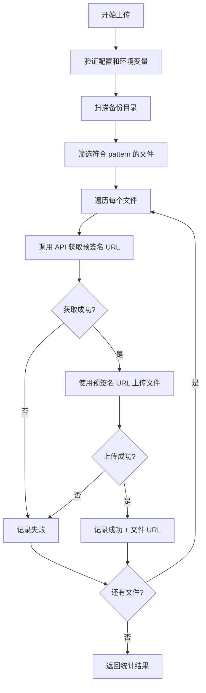

# 新威电池测试系统 - OSS 上传功能说明

## 功能概述

本次更新为新威电池测试系统添加了**阿里云 OSS 文件上传功能**，采用统一的 API 方式，允许将测试数据备份文件上传到云端存储。

## 版本更新说明

### ⚠️ 重大变更（2025-12-17）

本次更新将 OSS 上传方式从 **`oss2` 库** 改为 **统一 API 方式**，实现与团队其他系统的统一。

**主要变化**：
- ✅ 用 `requests` 库
- ✅ 通过统一 API 获取预签名 URL 进行上传
- ✅ 简化环境变量配置（仅需要 JWT Token）
- ✅ 返回文件访问 URL

## 主要改动

### 1. OSS 上传工具函数重构（第30-200行）

#### 新增函数

- **`get_upload_token(base_url, auth_token, scene, filename)`**  
  从统一 API 获取文件上传的预签名 URL
  
- **`upload_file_with_presigned_url(upload_info, file_path)`**  
  使用预签名 URL 上传文件到 OSS

#### 更新的函数

- **`upload_file_to_oss(local_file_path, oss_object_name)`**  
  上传单个文件到阿里云 OSS（使用统一 API 方式）
  - 返回值变更：成功时返回文件访问 URL，失败时返回 `False`
  
- **`upload_files_to_oss(file_paths, oss_prefix)`**  
  批量上传文件列表
  - `oss_prefix` 参数保留但暂不使用（接口兼容性）
  
- **`upload_directory_to_oss(local_dir, oss_prefix)`**  
  上传整个目录
  - 简化实现，直接使用文件名上传

### 2. 环境变量配置简化

#### 新方式（推荐）
```bash
# ✅ 必需
UNI_LAB_AUTH_TOKEN  # API Key 格式: "Api xxxxxx"

# ✅ 可选（有默认值）
UNI_LAB_BASE_URL (默认: https://uni-lab.test.bohrium.com)
UNI_LAB_UPLOAD_SCENE (默认: job，其他值会被改成 default)
```

### 3. 初始化方法（保持不变）

`__init__` 方法中的 OSS 相关配置参数：

```python
# OSS 上传配置
self.oss_upload_enabled = False  # 默认不启用 OSS 上传
self.oss_prefix = "neware_backup"  # OSS 对象路径前缀
self._last_backup_dir = None  # 记录最近一次的 backup_dir
```

**默认行为**：OSS 上传功能默认关闭（`oss_upload_enabled=False`），不影响现有系统。

### 4. upload_backup_to_oss 方法（保持不变）

```python
def upload_backup_to_oss(
    self, 
    backup_dir: str = None,
    file_pattern: str = "*",
    oss_prefix: str = None
) -> dict
```

## 使用说明

### 前置条件

#### 1. 安装依赖

```bash
# requests 库（通常已安装）
pip install requests
```

#### 2. 配置环境变量

根据您使用的终端类型配置环境变量：

##### PowerShell（推荐）

```powershell
# 必需：设置认证 Token（API Key 格式）
$env:UNI_LAB_AUTH_TOKEN = "Api xxxx"

# 可选：自定义服务器地址（默认为 test 环境）
$env:UNI_LAB_BASE_URL = "https://uni-lab.test.bohrium.com"

# 可选：自定义上传场景（默认为 job）
$env:UNI_LAB_UPLOAD_SCENE = "job"

# 验证是否设置成功
echo $env:UNI_LAB_AUTH_TOKEN
```

##### CMD / 命令提示符

```cmd
REM 必需：设置认证 Token（API Key 格式）
set UNI_LAB_AUTH_TOKEN=Api xxxx

REM 可选：自定义配置
set UNI_LAB_BASE_URL=https://uni-lab.test.bohrium.com
set UNI_LAB_UPLOAD_SCENE=job

REM 验证是否设置成功
echo %UNI_LAB_AUTH_TOKEN%
```

##### Linux/Mac

```bash
# 必需：设置认证 Token（API Key 格式）
export UNI_LAB_AUTH_TOKEN="Api xxxx"

# 可选：自定义配置
export UNI_LAB_BASE_URL="https://uni-lab.test.bohrium.com"
export UNI_LAB_UPLOAD_SCENE="job"

# 验证是否设置成功
echo $UNI_LAB_AUTH_TOKEN
```

#### 3. 获取认证 Token

> **重要**：从 Uni-Lab 主页 → 账号安全 中获取 API Key。

**获取步骤**：
1. 登录 Uni-Lab 系统
2. 进入主页 → 账号安全
3. 复制 API Key

Token 格式示例：
```
Api 48ccxx336fba44f39e1e37db93xxxxx
```

> **提示**：
> - 如果 Token 已经包含 `Api ` 前缀，直接使用
> - 如果没有前缀，代码会自动添加 `Api ` 前缀
> - 旧版 `Bearer` JWT Token 格式仍然兼容

#### 4. 持久化配置（可选）

**临时配置**：上述命令设置的环境变量只在当前终端会话中有效。

**持久化方式 1：PowerShell 配置文件**
```powershell
# 编辑 PowerShell 配置文件
notepad $PROFILE

# 在打开的文件中添加：
$env:UNI_LAB_AUTH_TOKEN = "Api 你的API_Key"
```

**持久化方式 2：Windows 系统环境变量**
- 右键"此电脑" → "属性" → "高级系统设置" → "环境变量"
- 添加用户变量或系统变量：
  - 变量名：`UNI_LAB_AUTH_TOKEN`
  - 变量值：`Api 你的API_Key`

### 使用流程

#### 步骤 1：启用 OSS 上传功能

**推荐方式：在 `device.json` 中配置**

编辑设备配置文件 `unilabos/devices/neware_battery_test_system/device.json`，在 `config` 中添加：

```json
{
    "nodes": [
        {
            "id": "NEWARE_BATTERY_TEST_SYSTEM",
            "config": {
                "ip": "127.0.0.1",
                "port": 502,
                "machine_id": 1,
                "oss_upload_enabled": true,
                "oss_prefix": "neware_backup/2025-12"
            }
        }
    ]
}
```

**参数说明**：
- `oss_upload_enabled`: 设置为 `true` 启用 OSS 上传
- `oss_prefix`: OSS 文件路径前缀，建议按日期或项目组织（暂时未使用，保留接口兼容性）

**其他方式：通过初始化参数**

```python
device = NewareBatteryTestSystem(
    ip="127.0.0.1",
    port=502,
    oss_upload_enabled=True,  # 启用 OSS 上传
    oss_prefix="neware_backup/2025-12"  # 可选：自定义路径前缀
)
```

**配置完成后，重启 ROS 节点使配置生效。**

#### 步骤 2：提交测试任务

使用 `submit_from_csv` 提交测试任务：

```python
result = device.submit_from_csv(
    csv_path="test_data.csv",
    output_dir="D:/neware_output"
)
```

此时会创建以下目录结构：
```
D:/neware_output/
├── xml_dir/          # XML 配置文件
└── backup_dir/       # 测试数据备份（由新威设备生成）
```

#### 步骤 3：等待测试完成

等待新威设备完成测试，备份文件会生成到 `backup_dir` 中。

#### 步骤 4：上传备份文件到 OSS

**方法 A：使用默认设置（推荐）**
```python
# 自动使用最近一次的 backup_dir，上传所有文件
result = device.upload_backup_to_oss()
```

**方法 B：指定备份目录**
```python
# 手动指定备份目录
result = device.upload_backup_to_oss(
    backup_dir="D:/neware_output/backup_dir"
)
```

**方法 C：筛选特定文件**
```python
# 仅上传 CSV 文件
result = device.upload_backup_to_oss(
    backup_dir="D:/neware_output/backup_dir",
    file_pattern="*.csv"
)

# 仅上传特定电池编号的文件
result = device.upload_backup_to_oss(
    file_pattern="Battery_A001_*.nda"
)
```

### 返回结果示例

**成功上传所有文件**：
```python
{
    "return_info": "全部上传成功: 15/15 个文件",
    "success": True,
    "uploaded_count": 15,
    "total_count": 15,
    "failed_files": [],
    "uploaded_files": [
        {
            "filename": "Battery_A001.ndax",
            "url": "https://uni-lab-test.oss-cn-zhangjiakou.aliyuncs.com/job/abc123.../Battery_A001.ndax"
        },
        {
            "filename": "Battery_A002.ndax",
            "url": "https://uni-lab-test.oss-cn-zhangjiakou.aliyuncs.com/job/abc123.../Battery_A002.ndax"
        }
        # ... 其他 13 个文件
    ]
}
```

**部分上传成功**：
```python
{
    "return_info": "部分上传成功: 12/15 个文件，失败 3 个",
    "success": True,
    "uploaded_count": 12,
    "total_count": 15,
    "failed_files": ["Battery_A003.csv", "Battery_A007.csv", "test.log"],
    "uploaded_files": [
        {
            "filename": "Battery_A001.ndax",
            "url": "https://uni-lab-test.oss-cn-zhangjiakou.aliyuncs.com/job/abc123.../Battery_A001.ndax"
        },
        {
            "filename": "Battery_A002.ndax",
            "url": "https://uni-lab-test.oss-cn-zhangjiakou.aliyuncs.com/job/abc123.../Battery_A002.ndax"
        }
        # ... 其他 10 个成功上传的文件
    ]
}
```

> **说明**：`uploaded_files` 字段包含所有成功上传文件的详细信息：
> - `filename`: 文件名（不含路径）
> - `url`: 文件在 OSS 上的完整访问 URL

## 错误处理

### OSS 上传未启用

如果 `oss_upload_enabled=False`，调用 `upload_backup_to_oss` 会返回：
```python
{
    "return_info": "OSS 上传未启用 (oss_upload_enabled=False)，跳过上传。备份目录: ...",
    "success": False,
    "uploaded_count": 0,
    "total_count": 0,
    "failed_files": []
}
```

**解决方法**：设置 `device.oss_upload_enabled = True`

### 环境变量未配置

如果缺少 `UNI_LAB_AUTH_TOKEN`，会返回：
```python
{
    "return_info": "OSS 环境变量配置错误: 请设置环境变量: UNI_LAB_AUTH_TOKEN",
    "success": False,
    ...
}
```

**解决方法**：按照前置条件配置环境变量

### 备份目录不存在

如果指定的备份目录不存在，会返回：
```python
{
    "return_info": "备份目录不存在: D:/neware_output/backup_dir",
    "success": False,
    ...
}
```

**解决方法**：检查目录路径是否正确，或等待测试生成备份文件

### API 认证失败

如果 Token 无效或过期，会返回：
```python
{
    "return_info": "获取凭证失败: 认证失败",
    "success": False,
    ...
}
```

**解决方法**：检查 Token 是否正确，或联系开发团队获取新 Token

## 技术细节

### OSS 上传流程（新方式）



### 上传 API 流程

1. **获取预签名 URL**
   - 请求：`GET /api/v1/applications/token?scene={scene}&filename={filename}`
   - 认证：`Authorization: Bearer {token}`
   - 响应：`{code: 0, data: {url: "预签名URL", path: "文件路径"}}`

2. **上传文件**
   - 请求：`PUT {预签名URL}`
   - 内容：文件二进制数据
   - 响应：HTTP 200 表示成功

3. **生成访问 URL**
   - 格式：`https://{OSS_PUBLIC_HOST}/{path}`
   - 示例：`https://uni-lab-test.oss-cn-zhangjiakou.aliyuncs.com/job/20251217/battery_data.csv`

### 日志记录

所有上传操作都会通过 ROS 日志系统记录：
- `INFO` 级别：上传进度和成功信息
- `WARNING` 级别：空目录、未启用等警告
- `ERROR` 级别：上传失败、配置错误

## 注意事项

1. **上传时机**：`backup_dir` 中的文件是在新威设备执行测试过程中实时生成的，请确保测试已完成再上传。

2. **文件命名**：上传到 OSS 的文件会保留原始文件名，路径由统一 API 分配。

3. **网络要求**：上传需要稳定的网络连接到阿里云 OSS 服务。

4. **Token 有效期**：JWT Token 有过期时间，过期后需要重新获取。

5. **成本考虑**：OSS 存储和流量会产生费用，请根据需要合理设置文件筛选规则。

6. **并发上传**：当前实现为串行上传，大量文件上传可能需要较长时间。

7. **文件大小限制**：请注意单个文件大小是否有上传限制（由统一 API 控制）。

## 兼容性

- ✅ **向后兼容**：默认 `oss_upload_enabled=False`，不影响现有系统
- ✅ **可选功能**：仅在需要时启用
- ✅ **独立操作**：上传失败不会影响测试任务的提交和执行
- ⚠️ **环境变量变更**：需要更新环境变量配置（从 OSS AK/SK 改为 JWT Token）

## 迁移指南

如果您之前使用 `oss2` 库方式，请按以下步骤迁移：

### 1. 卸载旧依赖（可选）
```bash
pip uninstall oss2
```

### 2. 删除旧环境变量
```powershell
# PowerShell
Remove-Item Env:\OSS_ACCESS_KEY_ID
Remove-Item Env:\OSS_ACCESS_KEY_SECRET
Remove-Item Env:\OSS_BUCKET_NAME
Remove-Item Env:\OSS_ENDPOINT
```

### 3. 设置新环境变量
```powershell
# PowerShell
$env:UNI_LAB_AUTH_TOKEN = "Bearer 你的token..."
```

### 4. 测试上传功能
```python
# 验证上传是否正常工作
result = device.upload_backup_to_oss(backup_dir="测试目录")
print(result)
```

## 常见问题

**Q: 为什么要从 `oss2` 改为统一 API？**  
A: 为了与团队其他系统保持一致，简化配置，并统一认证方式。

**Q: Token 在哪里获取？**  
A: 请联系开发团队获取有效的 JWT Token。

**Q: Token 过期了怎么办？**  
A: 重新获取新的 Token 并更新环境变量 `UNI_LAB_AUTH_TOKEN`。

**Q: 可以自定义上传路径吗？**  
A: 当前版本路径由统一 API 自动分配，`oss_prefix` 参数暂不使用（保留接口兼容性）。

**Q: 为什么不在 `submit_from_csv` 中自动上传？**  
A: 因为备份文件在测试进行中逐步生成，方法返回时可能文件尚未完全生成，因此提供独立的上传方法更灵活。

**Q: 上传后如何访问文件？**  
A: 上传成功后会返回文件访问 URL，格式为 `https://uni-lab-test.oss-cn-zhangjiakou.aliyuncs.com/{path}`

**Q: 如何删除已上传的文件？**  
A: 需要通过 OSS 控制台或 API 操作，本功能仅负责上传。

## 验证上传结果

### 方法1：通过阿里云控制台查看

1. 登录 [阿里云 OSS 控制台](https://oss.console.aliyun.com/)
2. 点击左侧 **Bucket列表**
3. 选择 `uni-lab-test` Bucket
4. 点击 **文件管理**
5. 查看上传的文件列表

### 方法2：使用返回的文件 URL

上传成功后，`upload_file_to_oss()` 会返回文件访问 URL：
```python
url = upload_file_to_oss("local_file.csv")
print(f"文件访问 URL: {url}")
# 输出示例：https://uni-lab-test.oss-cn-zhangjiakou.aliyuncs.com/job/20251217/local_file.csv
```

> **注意**：OSS 文件默认为私有访问，直接访问 URL 可能需要签名认证。

### 方法3：使用 ossutil 命令行工具

安装 [ossutil](https://help.aliyun.com/document_detail/120075.html) 后：

```bash
# 列出文件
ossutil ls oss://uni-lab-test/job/

# 下载文件到本地
ossutil cp oss://uni-lab-test/job/20251217/文件名 ./本地路径

# 生成签名URL（有效期1小时）
ossutil sign oss://uni-lab-test/job/20251217/文件名 --timeout 3600
```

## 更新日志

- **2025-12-17**: v2.0（重大更新）
  - ⚠️ 从 `oss2` 库改为统一 API 方式
  - 简化环境变量配置（仅需 JWT Token）
  - 新增 `get_upload_token()` 和 `upload_file_with_presigned_url()` 函数
  - `upload_file_to_oss()` 返回值改为文件访问 URL
  - 更新文档和迁移指南

- **2025-12-15**: v1.1
  - 添加初始化参数 `oss_upload_enabled` 和 `oss_prefix`
  - 支持在 `device.json` 中配置 OSS 上传
  - 更新使用说明，添加验证方法

- **2025-12-13**: v1.0 初始版本
  - 添加 OSS 上传工具函数（基于 `oss2` 库）
  - 创建 `upload_backup_to_oss` 动作方法
  - 支持文件筛选和自定义 OSS 路径

## 参考资料

- [Uni-Lab 统一文件上传 API 文档](https://uni-lab.test.bohrium.com/api/docs)（如有）
- [阿里云 OSS 控制台](https://oss.console.aliyun.com/)
- [ossutil 工具文档](https://help.aliyun.com/document_detail/120075.html)
