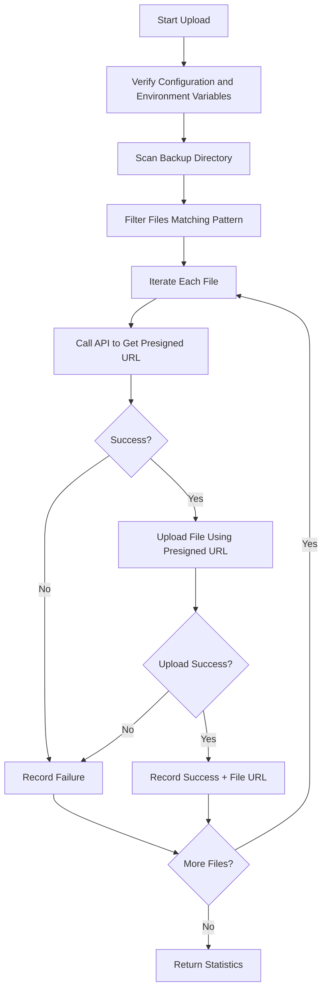

# Neware Battery Test System - OSS Upload Feature

## Overview

This update adds **Aliyun OSS file upload functionality** to the Neware Battery Test System using a unified API approach, allowing test data backup files to be uploaded to cloud storage.

## Version Updates

### ⚠️ Breaking Changes (2025-12-17)

This update changes the OSS upload method from **`oss2` library** to **unified API approach** to align with other team systems.

**Main Changes**:
- ✅ Use `requests` library
- ✅ Upload via presigned URLs obtained through unified API
- ✅ Simplified environment variable configuration (only API Key required)
- ✅ Returns file access URLs

## Main Changes

### 1. OSS Upload Functions Refactored (Lines 30-200)

#### New Functions

- **`get_upload_token(base_url, auth_token, scene, filename)`**  
  Obtain presigned URL for file upload from unified API
  
- **`upload_file_with_presigned_url(upload_info, file_path)`**  
  Upload file to OSS using presigned URL

#### Updated Functions

- **`upload_file_to_oss(local_file_path, oss_object_name)`**  
  Upload single file to Aliyun OSS (using unified API approach)
  - Return value changed: returns file access URL on success, `False` on failure
  
- **`upload_files_to_oss(file_paths, oss_prefix)`**  
  Batch upload file list
  - `oss_prefix` parameter retained but not used (interface compatibility)
  
- **`upload_directory_to_oss(local_dir, oss_prefix)`**  
  Upload entire directory
  - Simplified implementation, uploads using filenames directly

### 2. Simplified Environment Variable Configuration

#### Old Method (Deprecated)
```bash
# ❌ No longer used
OSS_ACCESS_KEY_ID
OSS_ACCESS_KEY_SECRET
OSS_BUCKET_NAME
OSS_ENDPOINT
```

#### New Method (Recommended)
```bash
# ✅ Required
UNI_LAB_AUTH_TOKEN  # API Key format: "Api xxxxxx"

# ✅ Optional (with defaults)
UNI_LAB_BASE_URL (default: https://uni-lab.test.bohrium.com)
UNI_LAB_UPLOAD_SCENE (default: job, other values will be changed to default)
```

### 3. Initialization Method (Unchanged)

OSS-related configuration parameters in `__init__` method:

```python
# OSS upload configuration
self.oss_upload_enabled = False  # OSS upload disabled by default
self.oss_prefix = "neware_backup"  # OSS object path prefix
self._last_backup_dir = None  # Record last backup_dir
```

**Default Behavior**: OSS upload is disabled by default (`oss_upload_enabled=False`), does not affect existing systems.

### 4. upload_backup_to_oss Method (Unchanged)

```python
def upload_backup_to_oss(
    self, 
    backup_dir: str = None,
    file_pattern: str = "*",
    oss_prefix: str = None
) -> dict
```

## Usage Guide

### Prerequisites

#### 1. Install Dependencies

```bash
# requests library (usually pre-installed)
pip install requests
```

> **Note**: No longer need to install `oss2` library

#### 2. Configure Environment Variables

Configure environment variables based on your terminal type:

##### PowerShell (Recommended)

```powershell
# Required: Set authentication Token (API Key format)
$env:UNI_LAB_AUTH_TOKEN = "Api xxxx"

# Optional: Custom server URL (defaults to test environment)
$env:UNI_LAB_BASE_URL = "https://uni-lab.test.bohrium.com"

# Optional: Custom upload scene (defaults to job)
$env:UNI_LAB_UPLOAD_SCENE = "job"

# Verify if set successfully
echo $env:UNI_LAB_AUTH_TOKEN
```

##### CMD / Command Prompt

```cmd
REM Required: Set authentication Token (API Key format)
set UNI_LAB_AUTH_TOKEN=Api xxxx

REM Optional: Custom configuration
set UNI_LAB_BASE_URL=https://uni-lab.test.bohrium.com
set UNI_LAB_UPLOAD_SCENE=job

REM Verify if set successfully
echo %UNI_LAB_AUTH_TOKEN%
```

##### Linux/Mac

```bash
# Required: Set authentication Token (API Key format)
export UNI_LAB_AUTH_TOKEN="Api xxxx"

# Optional: Custom configuration
export UNI_LAB_BASE_URL="https://uni-lab.test.bohrium.com"
export UNI_LAB_UPLOAD_SCENE="job"

# Verify if set successfully
echo $UNI_LAB_AUTH_TOKEN
```

#### 3. Obtain Authentication Token

> **Important**: Obtain API Key from Uni-Lab Homepage → Account Security.

**Steps to Obtain**:
1. Login to Uni-Lab system
2. Go to Homepage → Account Security
3. Copy your API Key

Token format example:
```
Api 48ccxx336fba44f39e1e37db93xxxxx
```

> **Tips**:
> - If Token already includes `Api ` prefix, use directly
> - If no prefix, code will automatically add `Api ` prefix
> - Old `Bearer` JWT Token format is still compatible

#### 4. Persistent Configuration (Optional)

**Temporary Configuration**: Environment variables set with the above commands are only valid for the current terminal session.

**Persistence Method 1: PowerShell Profile**
```powershell
# Edit PowerShell profile
notepad $PROFILE

# Add to the opened file:
$env:UNI_LAB_AUTH_TOKEN = "Api your_API_Key"
```

**Persistence Method 2: Windows System Environment Variables**
- Right-click "This PC" → "Properties" → "Advanced system settings" → "Environment Variables"
- Add user or system variable:
  - Variable name: `UNI_LAB_AUTH_TOKEN`
  - Variable value: `Api your_API_Key`

### Usage Workflow

#### Step 1: Enable OSS Upload Feature

**Recommended: Configure in `device.json`**

Edit device configuration file `unilabos/devices/neware_battery_test_system/device.json`, add to `config`:

```json
{
    "nodes": [
        {
            "id": "NEWARE_BATTERY_TEST_SYSTEM",
            "config": {
                "ip": "127.0.0.1",
                "port": 502,
                "machine_id": 1,
                "oss_upload_enabled": true,
                "oss_prefix": "neware_backup/2025-12"
            }
        }
    ]
}
```

**Parameter Description**:
- `oss_upload_enabled`: Set to `true` to enable OSS upload
- `oss_prefix`: OSS file path prefix, recommended to organize by date or project (currently unused, retained for interface compatibility)

**Alternative: Via Initialization Parameters**

```python
device = NewareBatteryTestSystem(
    ip="127.0.0.1",
    port=502,
    oss_upload_enabled=True,  # Enable OSS upload
    oss_prefix="neware_backup/2025-12"  # Optional: custom path prefix
)
```

**After configuration, restart the ROS node for changes to take effect.**

#### Step 2: Submit Test Tasks

Use `submit_from_csv` to submit test tasks:

```python
result = device.submit_from_csv(
    csv_path="test_data.csv",
    output_dir="D:/neware_output"
)
```

This creates the following directory structure:
```
D:/neware_output/
├── xml_dir/          # XML configuration files
└── backup_dir/       # Test data backup (generated by Neware device)
```

#### Step 3: Wait for Test Completion

Wait for the Neware device to complete testing. Backup files will be generated in the `backup_dir`.

#### Step 4: Upload Backup Files to OSS

**Method A: Use Default Settings (Recommended)**
```python
# Automatically uses the last backup_dir, uploads all files
result = device.upload_backup_to_oss()
```

**Method B: Specify Backup Directory**
```python
# Manually specify backup directory
result = device.upload_backup_to_oss(
    backup_dir="D:/neware_output/backup_dir"
)
```

**Method C: Filter Specific Files**
```python
# Upload only CSV files
result = device.upload_backup_to_oss(
    backup_dir="D:/neware_output/backup_dir",
    file_pattern="*.csv"
)

# Upload files for specific battery IDs
result = device.upload_backup_to_oss(
    file_pattern="Battery_A001_*.nda"
)
```

### Return Result Examples

**All Files Uploaded Successfully**:
```python
{
    "return_info": "All uploads successful: 15/15 files",
    "success": True,
    "uploaded_count": 15,
    "total_count": 15,
    "failed_files": [],
    "uploaded_files": [
        {
            "filename": "Battery_A001.ndax",
            "url": "https://uni-lab-test.oss-cn-zhangjiakou.aliyuncs.com/job/abc123.../Battery_A001.ndax"
        },
        {
            "filename": "Battery_A002.ndax",
            "url": "https://uni-lab-test.oss-cn-zhangjiakou.aliyuncs.com/job/abc123.../Battery_A002.ndax"
        }
        # ... other 13 files
    ]
}
```

**Partial Upload Success**:
```python
{
    "return_info": "Partial upload success: 12/15 files, 3 failed",
    "success": True,
    "uploaded_count": 12,
    "total_count": 15,
    "failed_files": ["Battery_A003.csv", "Battery_A007.csv", "test.log"],
    "uploaded_files": [
        {
            "filename": "Battery_A001.ndax",
            "url": "https://uni-lab-test.oss-cn-zhangjiakou.aliyuncs.com/job/abc123.../Battery_A001.ndax"
        },
        {
            "filename": "Battery_A002.ndax",
            "url": "https://uni-lab-test.oss-cn-zhangjiakou.aliyuncs.com/job/abc123.../Battery_A002.ndax"
        }
        # ... other 10 successfully uploaded files
    ]
}
```

> **Note**: The `uploaded_files` field contains detailed information for all successfully uploaded files:
> - `filename`: Filename (without path)
> - `url`: Complete OSS access URL for the file

## Error Handling

### OSS Upload Not Enabled

If `oss_upload_enabled=False`, calling `upload_backup_to_oss` returns:
```python
{
    "return_info": "OSS upload not enabled (oss_upload_enabled=False), skipping upload. Backup directory: ...",
    "success": False,
    "uploaded_count": 0,
    "total_count": 0,
    "failed_files": []
}
```

**Solution**: Set `device.oss_upload_enabled = True`

### Environment Variables Not Configured

If `UNI_LAB_AUTH_TOKEN` is missing, returns:
```python
{
    "return_info": "OSS environment variable configuration error: Please set environment variable: UNI_LAB_AUTH_TOKEN",
    "success": False,
    ...
}
```

**Solution**: Configure environment variables as per prerequisites

### Backup Directory Does Not Exist

If specified backup directory doesn't exist, returns:
```python
{
    "return_info": "Backup directory does not exist: D:/neware_output/backup_dir",
    "success": False,
    ...
}
```

**Solution**: Check if directory path is correct, or wait for test to generate backup files

### API Authentication Failed

If Token is invalid or expired, returns:
```python
{
    "return_info": "Failed to get credentials: Authentication failed",
    "success": False,
    ...
}
```

**Solution**: Check if Token is correct, or contact development team for new Token

## Technical Details

### OSS Upload Process (New Method)



### Upload API Flow

1. **Get Presigned URL**
   - Request: `GET /api/v1/lab/storage/token?scene={scene}&filename={filename}&path={path}`
   - Authentication: `Authorization: Api {api_key}` or `Authorization: Bearer {token}`
   - Response: `{code: 0, data: {url: "presigned_url", path: "file_path"}}`

2. **Upload File**
   - Request: `PUT {presigned_url}`
   - Content: File binary data
   - Response: HTTP 200 indicates success

3. **Generate Access URL**
   - Format: `https://{OSS_PUBLIC_HOST}/{path}`
   - Example: `https://uni-lab-test.oss-cn-zhangjiakou.aliyuncs.com/job/20251217/battery_data.csv`

### Logging

All upload operations are logged through ROS logging system:
- `INFO` level: Upload progress and success information
- `WARNING` level: Empty directory, not enabled warnings
- `ERROR` level: Upload failures, configuration errors

## Important Notes

1. **Upload Timing**: Files in `backup_dir` are generated in real-time during test execution. Ensure testing is complete before uploading.

2. **File Naming**: Files uploaded to OSS retain original filenames. Paths are assigned by unified API.

3. **Network Requirements**: Upload requires stable network connection to Aliyun OSS service.

4. **Token Expiration**: JWT Tokens have expiration time. Need to obtain new token after expiration.

5. **Cost Considerations**: OSS storage and traffic incur costs. Set file filtering rules appropriately.

6. **Concurrent Upload**: Current implementation uses serial upload. Large number of files may take considerable time.

7. **File Size Limits**: Note single file size upload limits (controlled by unified API).

## Compatibility

- ✅ **Backward Compatible**: Default `oss_upload_enabled=False`, does not affect existing systems
- ✅ **Optional Feature**: Enable only when needed
- ✅ **Independent Operation**: Upload failures do not affect test task submission and execution
- ⚠️ **Environment Variable Changes**: Need to update environment variable configuration (from OSS AK/SK to API Key)

## Migration Guide

If you previously used the `oss2` library method, follow these steps to migrate:

### 1. Uninstall Old Dependencies (Optional)
```bash
pip uninstall oss2
```

### 2. Remove Old Environment Variables
```powershell
# PowerShell
Remove-Item Env:\OSS_ACCESS_KEY_ID
Remove-Item Env:\OSS_ACCESS_KEY_SECRET
Remove-Item Env:\OSS_BUCKET_NAME
Remove-Item Env:\OSS_ENDPOINT
```

### 3. Set New Environment Variables
```powershell
# PowerShell
$env:UNI_LAB_AUTH_TOKEN = "Api your_API_Key"
```

### 4. Test Upload Functionality
```python
# Verify upload works correctly
result = device.upload_backup_to_oss(backup_dir="test_directory")
print(result)
```

## FAQ

**Q: Why change from `oss2` to unified API?**  
A: To maintain consistency with other team systems, simplify configuration, and unify authentication methods.

**Q: Where to get the Token?**  
A: Obtain API Key from Uni-Lab Homepage → Account Security.

**Q: What if Token expires?**  
A: Obtain a new API Key and update the `UNI_LAB_AUTH_TOKEN` environment variable.

**Q: Can I customize upload paths?**  
A: Current version has paths automatically assigned by unified API. `oss_prefix` parameter is currently unused (retained for interface compatibility).

**Q: Why not auto-upload in `submit_from_csv`?**  
A: Because backup files are generated progressively during testing, they may not be fully generated when the method returns. A separate upload method provides more flexibility.

**Q: How to access files after upload?**  
A: Upload success returns file access URL in format `https://uni-lab-test.oss-cn-zhangjiakou.aliyuncs.com/{path}`

**Q: How to delete uploaded files?**  
A: Need to operate through OSS console or API. This feature only handles uploads.

## Verifying Upload Results

### Method 1: Via Aliyun Console

1. Login to [Aliyun OSS Console](https://oss.console.aliyun.com/)
2. Click **Bucket List** on the left
3. Select the `uni-lab-test` Bucket
4. Click **File Management**
5. View uploaded file list

### Method 2: Using Returned File URL

After successful upload, `upload_file_to_oss()` returns file access URL:
```python
url = upload_file_to_oss("local_file.csv")
print(f"File access URL: {url}")
# Example output: https://uni-lab-test.oss-cn-zhangjiakou.aliyuncs.com/job/20251217/local_file.csv
```

> **Note**: OSS files are private by default, direct URL access may require signature authentication.

### Method 3: Using ossutil CLI Tool

After installing [ossutil](https://help.aliyun.com/document_detail/120075.html):

```bash
# List files
ossutil ls oss://uni-lab-test/job/

# Download file to local
ossutil cp oss://uni-lab-test/job/20251217/filename ./local_path

# Generate signed URL (valid for 1 hour)
ossutil sign oss://uni-lab-test/job/20251217/filename --timeout 3600
```

## Changelog

- **2025-12-17**: v2.0 (Major Update)
  - ⚠️ Changed from `oss2` library to unified API approach
  - Simplified environment variable configuration (only API Key required)
  - Added `get_upload_token()` and `upload_file_with_presigned_url()` functions
  - `upload_file_to_oss()` return value changed to file access URL
  - Updated documentation and migration guide
  - Token format: Support both `Api Key` and `Bearer JWT`
  - API endpoint: `/api/v1/lab/storage/token`
  - Scene parameter: Fixed to `job` (other values changed to `default`)

- **2025-12-15**: v1.1
  - Added initialization parameters `oss_upload_enabled` and `oss_prefix`
  - Support OSS upload configuration in `device.json`
  - Updated usage guide, added verification methods

- **2025-12-13**: v1.0 Initial Version
  - Added OSS upload utility functions (based on `oss2` library)
  - Created `upload_backup_to_oss` action method
  - Support file filtering and custom OSS paths

## References

- [Uni-Lab Unified File Upload API Documentation](https://uni-lab.test.bohrium.com/api/docs) (if available)
- [Aliyun OSS Console](https://oss.console.aliyun.com/)
- [ossutil Tool Documentation](https://help.aliyun.com/document_detail/120075.html)
